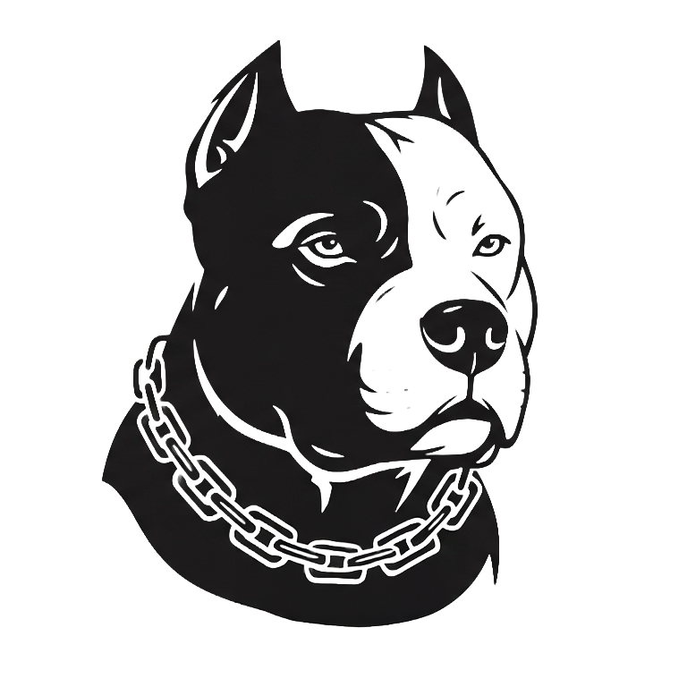

<p align="left">
  <picture>
    <source srcset="assets/cupcake-dark.png" media="(prefers-color-scheme: dark)">
    
  </picture>
</p>

# Cupcake - Agent Governance as Code

Policy enforcement engine that makes AI coding agents actually follow your rules.

> **Note**: Currently in beta with Claude Code support. The policy format is designed to be agent-agnostic, with eventual support for any coding agent hook system.

## Overview

Cupcake transforms natural language rules from CLAUDE.md files into deterministic YAML policies enforced through Claude Code's hooks system. Beyond simple enforcement, it provides an integrated feedback system that enables agents to self-correct and work autonomously for longer periods.

## Core Features

- **Small, yet powerful abstraction**: Manage 10s to 100s of rules without writing individual hooks
- **Deterministic enforcement**: Converts suggestions into guarantees through Claude Code hooks
- **Integrated feedback**: Enables agents to self-correct and continue working productively
- **Two-pass evaluation**: Aggregates all feedback before blocking, preventing iterative corrections
- **Stateful awareness**: Tracks session state for complex workflow enforcement
- **Performance optimized**: Binary caching and compiled patterns for minimal latency

## Policy Configuration

Policies are defined in YAML format using the guardrails structure:

```yaml
# guardrails/cupcake.yaml - Root configuration
settings:
  audit_logging: true
  debug_mode: false

imports:
  - "policies/*.yaml"
```

```yaml
# guardrails/policies/git-workflow.yaml - Policy fragments
PreToolUse:
  "Bash":
    - name: "Require passing tests before commit"
      description: "Block git commits when tests fail"
      conditions:
        - type: "pattern"
          field: "tool_input.command"
          regex: "^git\\s+commit"
        - type: "check"
          command: "cargo test --quiet"
          expected_exit_code: 1
      action:
        type: "block_with_feedback"
        message: "Tests must pass before committing"
        include_context: true

  "Write|Edit":
    - name: "Read architecture first"
      description: "Enforce reading architecture before engine edits"
      conditions:
        - type: "pattern"
          field: "tool_input.file_path"
          regex: "^src/engine/"
        - type: "check"
          command: "cupcake state has-read-file docs/architecture.md"
          expected_exit_code: 1
      action:
        type: "block_with_feedback"
        message: "Read docs/architecture.md before editing engine"
        include_context: true
```

## Architecture

- **CLI Binary**: Single Rust executable with init, sync, run, validate commands
- **Hook Integration**: Registers with Claude Code's lifecycle events
- **State Management**: Session tracking in `.cupcake/state/`
- **Policy Cache**: Binary serialization for fast loading
- **Two-pass evaluation**: Collects all feedback, then checks for blocks

## Installation

```bash
cargo install --path .
```

## Usage

1. **Initialize policies from CLAUDE.md:**

   ```bash
   cupcake init
   ```

2. **Sync with Claude Code hooks:**

   ```bash
   cupcake sync
   ```

3. **Runtime enforcement:**
   ```bash
   cupcake run --event PreToolUse
   ```

## Commands

- `cupcake init` - Generate policies from CLAUDE.md files
- `cupcake sync` - Update Claude Code hooks configuration
- `cupcake run` - Runtime policy enforcement (called by hooks)
- `cupcake validate` - Validate policy syntax

## Integration

Cupcake integrates with Claude Code through hooks:

- **PreToolUse**: Block operations before execution
- **PostToolUse**: Provide feedback after execution
- **Exit code 0**: Soft feedback (transcript only)
- **Exit code 2**: Hard block (Claude sees feedback)

## File Structure

```
guardrails/
├── cupcake.yaml          # Root configuration  
└── policies/            # Policy fragments
    ├── git-workflow.yaml
    ├── code-quality.yaml
    └── security-checks.yaml
.cupcake/
├── policy.cache         # Binary cache
├── state/               # Session tracking
└── audit.log           # Optional audit trail
.claude/
└── settings.json       # Hook configuration
```

## Performance

Sub-100ms response times through:

- Binary policy cache
- Compiled regex patterns
- Lazy state loading
- Static binary with zero runtime dependencies

## License

TBD
