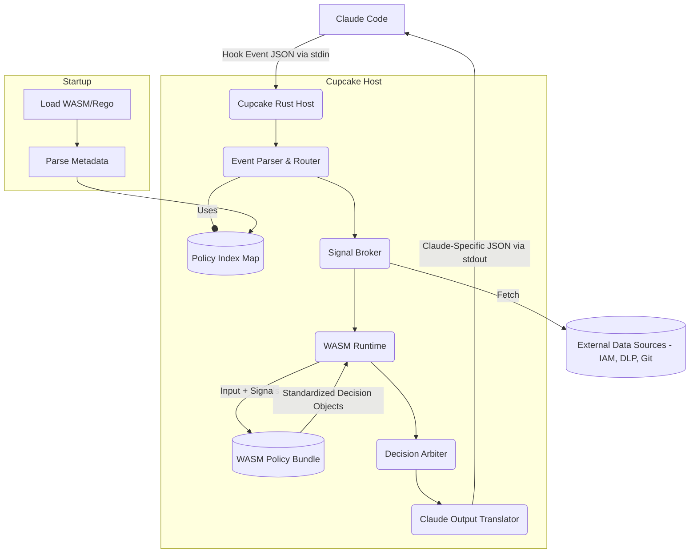

# Cupcake Architecture Reference

This document provides a comprehensive technical overview of Cupcake's architecture, design principles, and core components.

[https://excalidraw.com/#room=2331833bcb24d9f35a25,-TMNhQhHqtWayRMJam4ZIg](https://excalidraw.com/#room=2331833bcb24d9f35a25,-TMNhQhHqtWayRMJam4ZIg)

## Table of Contents

- [The Hybrid Model](#the-hybrid-model)
- [Architecture Diagram](#architecture-diagram)
- [Evaluation Flow](#evaluation-flow)
- [Core Components](#core-components)
- [Metadata-Driven Routing](#metadata-driven-routing)
- [Decision Verbs](#decision-verbs)
- [Single Aggregation Entrypoint](#single-aggregation-entrypoint)
- [Signals (Proactive Enrichment)](#signals-proactive-enrichment)
- [Actions (Fire-and-Forget)](#actions-fire-and-forget)
- [Design Principles](#design-principles)
- [Performance Characteristics](#performance-characteristics)

---

## The Hybrid Model

Cupcake implements a **Hybrid Model** that separates policy logic from execution infrastructure:

- **Rego (WASM)**: Declares policies, evaluates rules, returns decision verbs
- **Rust (Engine)**: Routes events, gathers signals, synthesizes final decisions

This separation provides:

- **Policy Portability**: Rego policies are platform-independent WASM modules
- **Engine Intelligence**: Rust handles optimization, routing, and orchestration
- **Clear Separation**: Policies focus on business logic, engine focuses on performance

The engine is intelligent - it discovers policies via metadata, understands their requirements, and routes events efficiently using O(1) lookups.

---

## Architecture Diagram



---

## Evaluation Flow

Every event follows this deterministic flow:

```
Claude Code Event (JSON) → Cupcake → Claude Code Response (JSON)
                            ↓
                    1. Route (O(1) metadata lookup)
                    2. Gather Signals (proactive)
                    3. Evaluate (WASM via cupcake.system.evaluate)
                    4. Synthesize (apply priority hierarchy)
                    5. Execute Actions (async, non-blocking)
                    6. Format Response
```

### Step-by-Step Breakdown

**1. Route (O(1) lookup)**

- Parse incoming hook event (PreToolUse, PostToolUse, UserPromptSubmit, etc.)
- Look up routing key in pre-built HashMap (e.g., `PreToolUse:Bash`)
- Return list of matching policies based on metadata
- Wildcard policies (no specific tool) are included automatically

**2. Gather Signals (proactive)**

- Collect `required_signals` from all matched policies
- Execute signal scripts in parallel (with timeout protection)
- Enrich event input with signal results
- No signal execution if no policies match (zero overhead)

**3. Evaluate (WASM)**

- Pass enriched input to single WASM entrypoint: `cupcake.system.evaluate`
- WASM walks policy hierarchy using `walk()` to discover all decision verbs
- Returns DecisionSet with categorized verbs: halts, denials, blocks, asks, allow_overrides, add_context
- Sandboxed execution prevents policy code from escaping

**4. Synthesize (priority hierarchy)**

- Apply strict priority ordering:
  1. halt (highest - immediate termination)
  2. deny/block (prevent action)
  3. ask (require user confirmation)
  4. allow_override (explicit permission)
  5. add_context (lowest - inject guidance)
- First verb in priority order wins
- Collect all context to inject regardless of decision

**5. Execute Actions (async)**

- Fire configured actions based on decision type
- Non-blocking: actions run in background
- Actions can be triggered by: decision type, specific rule violations, or custom conditions

**6. Format Response**

- Transform internal decision to harness-specific JSON
- Claude Code: Maps to `continue`, `permissionDecision`, `hookSpecificOutput`, etc.
- Returns via stdout as valid JSON

---

## Core Components

### 1. Engine (`cupcake-core/src/engine/`)

The engine is the orchestration layer:

**Scanner** - Discovers `.rego` files in policy directories

- Recursively scans `.cupcake/policies/`
- Identifies all policy files for compilation

**Metadata Parser** - Extracts routing from `# METADATA` blocks

- Parses OPA metadata annotations
- Builds routing requirements: events, tools, signals
- Validates metadata format

**Router** - O(1) event-to-policy matching

- Builds HashMap at startup: `event:tool` → `[policies]`
- Supports wildcards: policies without tools match all tools
- Separate namespaces for global vs project policies

**Compiler** - Creates unified WASM module

- Invokes OPA to compile all policies into single WASM bundle
- Single entrypoint: `cupcake.system.evaluate`
- Includes both project and global policies

**Runtime** - Executes WASM with enriched input

- Uses `wasmtime` runtime (v35.0)
- Passes JSON input with signals
- Returns DecisionSet

**Synthesis** - Applies decision priority hierarchy

- Deterministic priority ordering
- Handles edge cases (multiple decisions of same type)
- Produces final EngineDecision

### 2. Harness (`cupcake-core/src/harness/`)

Pure data transformation layer between engine and agent:

**Events** - Strongly-typed structures for Claude Code events

- PreToolUse, PostToolUse, UserPromptSubmit, SessionStart, etc.
- Serde deserialization from JSON stdin
- Common fields extracted for all event types

**Response** - Spec-compliant JSON builders

- Separate builders for each event type
- Maps EngineDecision to Claude Code JSON format
- Handles context injection for supported events

**No Business Logic** - Harness is purely transformational

- Does not make policy decisions
- Only formats engine output

### 3. Trust System (`cupcake-core/src/trust/`)

Script integrity verification:

**HMAC-based verification**

- Computes HMAC-SHA256 for signal/action scripts
- Stores HMACs in `.cupcake/trust/manifest.yml`
- Verifies before execution

**Project-specific key derivation**

- Derives keys from system entropy + project path
- Different projects have different trust boundaries
- Prevents cross-project trust violations

**Tamper detection**

- Detects any script modification
- Fails safely: denies execution on verification failure
- User must re-approve with `cupcake trust update`

---

## Metadata-Driven Routing

Policies declare their requirements via OPA metadata blocks:

```rego
# METADATA
# scope: package
# title: Bash Security Guard
# authors: ["Security Team"]
# custom:
#   routing:
#     required_events: ["PreToolUse"]
#     required_tools: ["Bash"]
#     required_signals: ["git_branch"]
package cupcake.policies.bash_guard

import rego.v1

# Policy rules follow...
```

### Routing Metadata Fields

**required_events** - Which hook events this policy cares about

- Example: `["PreToolUse", "PostToolUse"]`
- Creates routing entries for each event type

**required_tools** - Which tools within those events

- Example: `["Bash", "Edit"]`
- Empty list = wildcard (matches all tools)

**required_signals** - What data this policy needs

- Example: `["git_branch", "current_user"]`
- Engine executes these signals before policy evaluation

### Routing Key Generation

The engine generates routing keys at startup:

- **Specific**: `PreToolUse:Bash` - Exact event + tool match
- **Wildcard**: `PreToolUse` - Event only (all tools)
- **MCP tools**: `PreToolUse:mcp__postgres__execute_sql` - Full MCP tool name

Wildcards are automatically merged into specific routes for efficiency.

### Why Metadata-Driven?

**Trust** - Policies trust the engine's routing

- No need to check event types in policy code
- If policy is evaluating, routing requirements are met

**Performance** - O(1) routing lookups

- No scanning through all policies per event
- Only matched policies execute signals

**Clarity** - Routing requirements are declarative

- Easy to see what each policy applies to
- No hidden logic in policy code

---

## Decision Verbs

Policies output decisions using standardized verb sets:

```rego
# Deny dangerous commands
deny contains decision if {
    contains(input.tool_input.command, "rm -rf /")
    decision := {
        "reason": "Dangerous rm command detected",
        "severity": "HIGH",
        "rule_id": "BASH-001"
    }
}

# Ask for confirmation on production
ask contains decision if {
    input.signals.git_branch == "main"
    decision := {
        "reason": "Production branch - please confirm",
        "severity": "MEDIUM",
        "rule_id": "BASH-002"
    }
}

# Add context for best practices
add_context contains "Remember to run tests before committing" if {
    contains(input.tool_input.command, "git commit")
}
```

### Available Verbs

**halt** - Immediate cessation (highest priority)

- Used for critical violations
- Stops all execution immediately
- Cannot be overridden

**deny** - Prevent action (PreToolUse only)

- Blocks tool execution before it happens
- Maps to `permissionDecision: "deny"` in Claude Code

**block** - Prevent continuation (PostToolUse, Stop, UserPromptSubmit)

- Blocks after tool execution or during prompts
- Maps to `decision: "block"` in Claude Code

**ask** - Require confirmation (PreToolUse only)

- Prompts user before allowing action
- Maps to `permissionDecision: "ask"` in Claude Code

**allow_override** - Explicit permission

- Useful for exempting specific cases
- Lower priority than deny/block/ask

**add_context** - Inject guidance

- Adds informational messages to Claude
- Doesn't block execution
- Multiple contexts are concatenated

### Verb Priority Hierarchy

The synthesis layer enforces strict priority:

1. **halt** - Immediate cessation (highest priority)
2. **deny/block** - Prevent action
3. **ask** - Require confirmation
4. **allow_override** - Explicit permission
5. **add_context** - Inject guidance (lowest priority)

First verb in priority order wins. Context injection happens regardless of decision.

---

## Single Aggregation Entrypoint

All policies are evaluated through `cupcake.system.evaluate`:

```rego
package cupcake.system
import rego.v1

# The single aggregation entrypoint
evaluate := decision_set if {
    decision_set := {
        "halts": collect_verbs("halt"),
        "denials": collect_verbs("deny"),
        "blocks": collect_verbs("block"),
        "asks": collect_verbs("ask"),
        "allow_overrides": collect_verbs("allow_override"),
        "add_context": collect_verbs("add_context")
    }
}

# Collect all decisions from a verb across the policy hierarchy
collect_verbs(verb_name) := result if {
    # Use walk() to traverse data.cupcake.policies
    # Aggregate all decisions for the verb
    result := [decision |
        walk(data.cupcake.policies, [path, value])
        # ... discovery logic
    ]
}
```

### Why Single Entrypoint?

**Automatic Discovery** - No manual policy registration

- `walk()` traverses entire policy hierarchy
- Discovers all policies dynamically
- New policies work immediately

**Unified WASM Module** - All policies compile together

- Single WASM file for entire policy set
- No dynamic loading overhead
- Efficient evaluation

**Consistent Output** - Standardized DecisionSet

- Engine always receives same structure
- Easy to version and validate
- Clear contract between WASM and engine

---

## Signals (Proactive Enrichment)

Signals are gathered **before** policy evaluation (not reactively):

1. Engine routes event to policies
2. Collects all `required_signals` from matched policies
3. Executes signals in parallel (with timeout protection)
4. Enriches input with signal data
5. Evaluates policies with enriched input

### Signal Definition

Example signal in `rulebook.yml`:

```yaml
signals:
  git_branch:
    command: "git rev-parse --abbrev-ref HEAD 2>/dev/null || echo 'unknown'"
    timeout_seconds: 5

  current_user:
    command: "whoami"
    timeout_seconds: 2
```

### Signal Execution

**Parallel Execution** - All signals run concurrently

- Uses Tokio async runtime
- Respects individual timeouts
- Continues if some signals fail

**Timeout Protection** - Prevents hanging signals

- Default: 5 seconds
- Configurable per signal
- Failed signals return empty/error value

**Caching** - Results cached per evaluation

- Same signal not executed multiple times
- Cache cleared between events

### Signal Access in Policies

Signals appear in `input.signals`:

```rego
deny contains decision if {
    input.signals.git_branch == "main"
    contains(input.tool_input.command, "force-push")
    decision := {
        "reason": "Force push blocked on main branch",
        "severity": "HIGH",
        "rule_id": "GIT-001"
    }
}
```

---

## Actions (Fire-and-Forget)

Actions execute asynchronously after decision synthesis:

```yaml
actions:
  on_any_denial:
    - command: "echo 'Action denied' | tee -a /tmp/cupcake.log"

  on_halt:
    - command: "notify-send 'Cupcake' 'Critical action halted'"

  violations:
    BASH-001:
      - command: "alert-security-team.sh"
```

### Action Triggers

**Decision-based** - Trigger on decision type

- `on_any_denial` - Fires when any deny/block occurs
- `on_halt` - Fires when halt decision made
- `on_ask` - Fires when user confirmation required

**Rule-based** - Trigger on specific rule violations

- Uses `rule_id` from decision objects
- Maps violations to custom actions
- Allows targeted responses

### Execution Model

**Async/Non-blocking** - Actions don't delay response

- Spawn in background via Tokio
- Don't affect latency
- Failures logged but don't block

**No Guarantees** - Best-effort execution

- Actions may fail without breaking evaluation
- Use for logging, notifications, webhooks
- Not for critical path operations

---

## Design Principles

### 1. Metadata-Driven

Policies declare requirements, engine handles routing:

- Policies don't need to check if they should run
- Engine ensures policies only evaluate when relevant
- Clear separation of concerns

### 2. Single Aggregation

All evaluation through `cupcake.system.evaluate`:

- Automatic policy discovery
- No manual registration
- Consistent evaluation contract

### 3. Proactive Signals

Gathered before evaluation, not reactively:

- Efficient parallel execution
- No reactive overhead during evaluation
- Policies receive enriched input

### 4. Strict Priority

Synthesis layer enforces decision hierarchy:

- Deterministic outcomes
- No policy conflicts
- Clear precedence rules

### 5. Trust by Default

Scripts verified via HMAC before execution:

- Tamper detection
- User must approve script changes
- Project-specific trust boundaries

### 6. Intelligence in the Engine

Rust engine handles optimization, Rego focuses on logic:

- Routing, synthesis, optimization = Engine
- Business logic, rules, decisions = Policies
- Clean separation enables independent evolution

---

## Performance Characteristics

### Targets

- **Policy discovery and compilation**: < 100ms
- **Event routing**: O(1) lookup
- **Policy evaluation**: < 50ms
- **Full request cycle**: < 200ms

### Optimization Strategies

**Routing** - O(1) HashMap lookups

- Pre-built at startup
- No scanning per event
- Wildcard policies merged efficiently

**Signals** - Only execute when needed

- No policies matched = no signals executed
- Parallel execution
- Timeout protection prevents hanging

**WASM** - Compiled policies, not interpreted

- Near-native performance
- Sandboxed security
- Single module reduces overhead

**Synthesis** - Simple priority comparison

- No complex logic
- Deterministic ordering
- Minimal CPU usage

**Actions** - Fire-and-forget async

- Don't block response
- Background execution
- No latency impact

---

## Related Documentation

- **[Policy Routing System](../developer/policy-routing-system.md)** - Deep-dive on routing internals
- **[Development Guide](../development/DEVELOPMENT.md)** - Building and extending Cupcake
- **[Debugging Guide](../development/DEBUGGING.md)** - Troubleshooting and tracing
- **[Writing Policies](../user-guide/policies/writing-policies.md)** - Policy authoring guide
