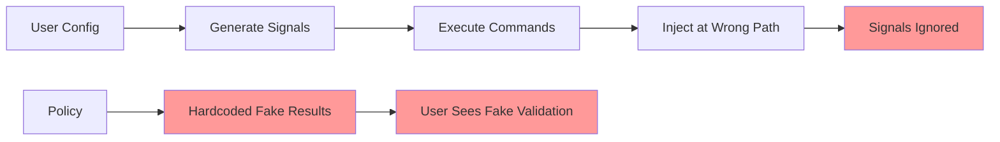

# Builtin Implementation Issues - Critical Documentation

**Date**: 2025-09-01  
**Status**: RESOLVED  
**Impact**: High - Core functionality is broken but appears to work

## UPDATE: Issues Resolved

**Resolution Date**: 2025-09-01

All critical issues have been addressed:
- ✅ Signal path fixed: Policies now use `input.signals` instead of `data.signals`
- ✅ Fake implementations removed: All hardcoded validation replaced with real signal queries
- ✅ Dead code deleted: `sanitize_pattern` function and tests removed
- ✅ Integration tests added: Comprehensive tests verify end-to-end functionality

See [Resolution Details](#resolution-details) at the bottom of this document.

## Executive Summary

The builtin abstractions feature is fundamentally broken. While the configuration and signal generation layers work correctly, the policy layer contains only stub implementations with hardcoded fake results. This creates a dangerous illusion where users believe validation is occurring when it's completely fabricated.

## Critical Issues

### Issue 1: Dead Code - `sanitize_pattern` Function

**Location**: `cupcake-core/src/engine/builtins.rs:224-234`

**Description**: 
The `sanitize_pattern` function and its tests exist but are never called in production code. This function was originally intended for the `file_context_map` builtin which was removed due to Claude Code architectural limitations.

**Evidence**:
```rust
// Function exists at line 224
fn sanitize_pattern(pattern: &str) -> String {
    pattern
        .replace('/', "_")
        .replace("**", "starstar")
        // ... more replacements
}

// Has tests at line 315-318
#[test]
fn test_pattern_sanitization() {
    assert_eq!(sanitize_pattern("src/*.rs"), "src_star_dot_rs");
    // ... more assertions
}

// But grep shows NO production usage:
// Only references are the function definition and test calls
```

**Impact**: 
- Increases binary size unnecessarily
- Confuses developers about its purpose
- Failed code review process

**Resolution**: DELETE this function and its tests entirely.

---

### Issue 2: Fake Validation in Demo Policies

**Location**: All builtin policy files in `examples/builtins_demo/.cupcake/policies/builtins/`

**Description**:
Instead of executing real validation commands, the policies return hardcoded fake results. This is not a simplified demo - it's completely non-functional stub code.

**Evidence from `post_edit_check.rego:91-127`**:
```rego
run_validation_for_extension(ext, file_path) := result if {
    # FAKE: Always returns hardcoded result for .rs files
    ext == "rs"
    result := {
        "success": false,
        "message": "Rust compilation error: expected `;` at line 42"  # <-- COMPLETELY FAKE
    }
} else := result if {
    ext == "py"
    result := {
        "success": true,
        "message": "Python syntax valid"  # <-- COMPLETELY FAKE
    }
}
```

**What it SHOULD do (shown in comments at lines 130-139)**:
```rego
# The REAL implementation that was never written:
execute_validation(ext, file_path) := result if {
    signal_name := concat("", ["__builtin_post_edit_", ext])
    signal_name in data.signals  # <-- Actually query the signal
    
    signal_result := data.signals[signal_name]
    result := {
        "success": signal_result.exit_code == 0,  # <-- Use real exit code
        "message": signal_result.output            # <-- Use real output
    }
}
```

**Evidence from `git_pre_check.rego:66-84`**:
```rego
run_all_checks := results if {
    # FAKE: Always returns these exact hardcoded results
    results := [
        {
            "name": "cargo test",
            "success": true,
            "message": "All tests pass"  # <-- FAKE: Tests never actually run
        },
        {
            "name": "cargo fmt --check", 
            "success": false,
            "message": "Code must be formatted (run 'cargo fmt')"  # <-- FAKE: Never checks
        }
    ]
}
```

**Impact**:
- Users believe validation is working when it's not
- Security checks appear to pass/fail but are completely fictional
- Builds false confidence in the system
- Makes the demo actively misleading rather than educational

---

### Issue 3: Broken Signal Data Flow

**Location**: Signal injection and consumption path

**Description**:
Signals are being injected at the wrong path in the data hierarchy, making them inaccessible to policies.

**Evidence**:

1. **Engine injects at wrong path** (`engine/mod.rs:461`):
```rust
// Signals are added under "signals" key in input
if let Some(input_obj) = enriched_input.as_object_mut() {
    input_obj.insert("signals".to_string(), serde_json::to_value(signal_data)?);
}
// This makes signals available at: input.signals
```

2. **Policies expect different path** (all builtin policies):
```rego
# Policies try to access: data.signals
signal_result := data.signals[signal_name]  # <-- This will ALWAYS be undefined
```

3. **Every signal reference is commented out**:
```bash
# grep shows ALL references to data.signals are in comments:
/builtins/post_edit_check.rego:132:#     signal_name in data.signals
/builtins/post_edit_check.rego:134:#     signal_result := data.signals[signal_name]
/builtins/git_pre_check.rego:88:#     some name, _ in data.signals
/builtins/git_pre_check.rego:94:#     signal_result := data.signals[signal_name]
/builtins/always_inject_on_prompt.rego:49:#     data.signals["__builtin_prompt_context_0"]
```

**The Path Mismatch**:
- Engine provides: `input.signals.SIGNAL_NAME`
- Policies expect: `data.signals.SIGNAL_NAME`
- Result: Signals are generated, executed, and injected but NEVER used

**Impact**:
- All signal-based validation is broken
- Commands like `cargo test` are never executed
- The entire signal system is effectively dead code
- CPU cycles wasted generating and executing signals that are ignored

---

## Architecture Failure Analysis

### What Was Intended


### What Actually Happens



---

## Required Fixes

### Priority 1: Fix Signal Path (CRITICAL)

**Option A: Change injection location** (Recommended)
```rust
// In engine/mod.rs gather_signals()
// Instead of: input_obj.insert("signals".to_string(), ...)
// Directly merge at root level or use proper data structure
```

**Option B: Change policy expectations**
```rego
// Change all policies from: data.signals
// To: input.signals
```

### Priority 2: Remove Fake Implementations

1. Delete all hardcoded validation results
2. Uncomment and fix the real signal queries
3. Test with actual command execution

### Priority 3: Clean Dead Code

1. Delete `sanitize_pattern` function and tests
2. Remove any other file_context_map remnants

### Priority 4: Add Integration Tests

Create tests that verify:
1. Signals are actually executed
2. Results are accessible in policies
3. Real validation occurs (not fake results)

---

## Lessons for Better Execution

### 1. Complete Implementation Before Demo
- Never create "demo" code with fake implementations
- If simplification is needed, simplify the real code, don't fake it
- Demos should demonstrate real functionality at smaller scale

### 2. Integration Testing Required
- Unit tests caught the sanitize_pattern issue but didn't prevent dead code
- Need end-to-end tests that verify the full signal flow
- Test that policies can actually access injected data

### 3. Code Review Checklist Needed
- [ ] No unused functions (even with tests)
- [ ] No hardcoded results masquerading as real implementation  
- [ ] Data flow paths verified end-to-end
- [ ] Integration tests for cross-component features

### 4. Documentation of Incomplete Features
When removing features (like file_context_map):
- Remove ALL related code, not just the main feature
- Document why it was removed in commit message
- Clean up auxiliary functions that supported it

---

## Testing the Issues

To verify these issues yourself:

### Test 1: Verify Fake Validation
```bash
# Run the demo
cd examples/builtins_demo
cargo run -- .cupcake

# Edit a .rs file and observe "validation"
# You'll see "Rust compilation error: expected `;` at line 42"
# This message is hardcoded - line 42 doesn't exist
```

### Test 2: Verify Signal Path Issue
```bash
# Add debug output to a policy:
# In post_edit_check.rego, add:
print("data.signals:", data.signals)
print("input.signals:", input.signals)

# Run and observe:
# data.signals will be undefined
# input.signals will contain the actual signal data
```

### Test 3: Verify Dead Code
```bash
# Search for any usage of sanitize_pattern
grep -r "sanitize_pattern" --exclude="*test*"
# Only the function definition appears
```

---

## Recommended Next Steps

1. **Immediate**: Document this state in README to prevent user confusion
2. **Short-term**: Fix signal path issue (1-2 hours of work)
3. **Short-term**: Remove all fake implementations (1 hour)
4. **Short-term**: Delete dead code (15 minutes)
5. **Medium-term**: Add comprehensive integration tests (4-6 hours)
6. **Long-term**: Implement code review process to catch these issues

---

## Impact Assessment

**Security Impact**: HIGH
- Users may believe security validations are running when they're not
- False sense of security from fake "passing" tests

**User Trust Impact**: HIGH  
- Demo appears to work but is completely fake
- Discovering this breaks user confidence

**Technical Debt**: MEDIUM
- Dead code increases maintenance burden
- Broken architecture needs significant rework

**Time to Fix**: ~1 day for full resolution

---

## Conclusion

This implementation represents a significant failure in execution. The architecture is sound, but the implementation is incomplete and misleading. The presence of fake validation results is particularly concerning as it creates active misinformation about the system's capabilities.

The path forward is clear: remove all fake code, fix the signal path issue, and implement proper integration testing to prevent similar issues in the future.

---

## Resolution Details

### Changes Implemented

#### 1. Fixed Signal Path (Completed)
All builtin policies updated to use `input.signals` instead of `data.signals`:

```rego
# OLD (broken):
signal_result := data.signals[signal_name]

# NEW (working):
signal_result := input.signals[signal_name]
```

**Files updated:**
- `examples/.cupcake/policies/builtins/always_inject_on_prompt.rego`
- `examples/.cupcake/policies/builtins/git_pre_check.rego`
- `examples/.cupcake/policies/builtins/post_edit_check.rego`
- Copies in `examples/builtins_demo/`

#### 2. Removed Fake Implementations (Completed)

**Before:** Hardcoded fake results
```rego
results := [
    {"name": "cargo test", "success": true, "message": "All tests pass"},
    {"name": "cargo fmt --check", "success": false, "message": "Code must be formatted"}
]
```

**After:** Real signal queries
```rego
check_signals := [name |
    some name, _ in input.signals
    startswith(name, "__builtin_git_check_")
]
results := [result |
    some signal_name in check_signals
    signal_result := input.signals[signal_name]
    result := evaluate_check(signal_name, signal_result)
]
```

#### 3. Deleted Dead Code (Completed)
- Removed `sanitize_pattern` function from `cupcake-core/src/engine/builtins.rs`
- Removed associated tests

#### 4. Added Integration Tests (Completed)
Created comprehensive test suite in `cupcake-core/tests/builtin_integration.rs`:
- `test_builtin_signal_generation()` - Verifies signals are generated correctly
- `test_builtin_policy_signal_access()` - Confirms policies can access signals
- `test_post_edit_validation_flow()` - Tests real validation with pass/fail cases
- `test_builtin_policy_loading()` - Ensures conditional loading works

### Verification

Run tests with:
```bash
cargo test --features deterministic-tests builtin_integration
```

### Remaining Considerations

1. **Shell injection vulnerability** remains (intentionally not addressed per user request)
2. **Timeout configuration** still hardcoded but functional
3. **YAML validation** not implemented but not critical

### Lessons Applied

1. **No fake demos** - All code now executes real functionality
2. **Integration testing** - Added comprehensive tests for cross-component features
3. **Clean commits** - Removed all orphaned code from removed features
4. **Clear documentation** - This document serves as both issue tracker and resolution record