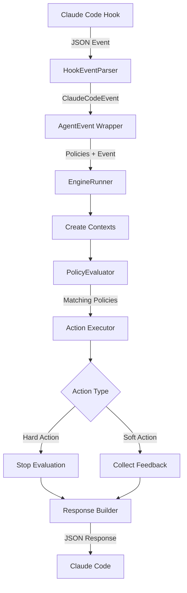

# Cupcake Architecture

<!-- Last Verified: 2025-08-04 -->

## Overview

Cupcake is designed as a modular policy enforcement engine for AI coding agents. The architecture emphasizes security, extensibility, and performance while maintaining 100% compatibility with Claude Code's hook specification.

## Core Design Principles

1. **Agent-Agnostic Core**: While currently focused on Claude Code, the architecture supports multiple agent types through the AgentEvent abstraction
2. **Single Source of Truth**: Context creation happens in one place (EngineRunner) to prevent inconsistencies
3. **Security by Default**: Environment variables are filtered through an allow-list, command execution uses direct process spawning
4. **Type-Safe Response Generation**: Modular builders ensure spec-compliant JSON responses
5. **Two-Pass Evaluation**: Collects all feedback before making blocking decisions

## Module Structure

```
cupcake/
├── cli/               # Command-line interface
│   ├── app.rs        # CLI app definition
│   └── commands/     # Command implementations
│       ├── run/      # Hook event processing
│       │   ├── engine.rs      # EngineRunner orchestrator
│       │   ├── context.rs     # Context builders
│       │   └── parser.rs      # Event parsing
│       └── ...
├── config/           # Configuration and policy loading
│   ├── loader.rs    # YAML parsing and composition
│   ├── types.rs     # Core type definitions
│   └── actions.rs   # Action definitions
├── engine/           # Policy evaluation engine
│   ├── evaluation.rs        # PolicyEvaluator
│   ├── environment.rs       # SanitizedEnvironment
│   ├── events/             # Event type system
│   │   └── claude_code/   # Claude Code events
│   └── response/          # Response generation
│       └── claude_code/   # Modular builders
└── io/              # I/O and path utilities
```

## Key Components

### EngineRunner

The central orchestrator that:
- Creates evaluation and action contexts internally
- Coordinates policy evaluation
- Executes actions
- Generates responses

```rust
pub fn run(
    &mut self,
    policies: &[ComposedPolicy],
    agent_event: &AgentEvent,
) -> Result<EngineResult>
```

### AgentEvent System

Abstraction layer for multi-agent support:
- `AgentEvent` enum wraps agent-specific events
- Currently contains `ClaudeCodeEvent` variant
- Extensible for future agent types

### PolicyEvaluator

Implements the two-pass evaluation system:
1. **Pass 1**: Collects all soft actions (feedback)
2. **Pass 2**: Finds first hard action (block/allow/ask)

Features intelligent matcher handling:
- Empty string ("") and wildcard ("*") are equivalent
- Non-tool events use `get_match_query()` for custom matching
- PreCompact matches against trigger field
- SessionStart matches against source field

### SanitizedEnvironment

Security module that filters environment variables:
- Hardcoded allow-list for safety
- Always preserves CLAUDE_PROJECT_DIR and CLAUDE_SESSION_ID
- Blocks sensitive variables (AWS keys, tokens, etc.)

### Response Builders

Modular builders for 100% Claude Code spec compliance:
- `PreToolUseResponseBuilder`: Permission decisions
- `FeedbackLoopResponseBuilder`: PostToolUse/Stop events
- `ContextInjectionResponseBuilder`: UserPromptSubmit/SessionStart
- `GenericResponseBuilder`: Notification/PreCompact

## Data Flow



## Security Architecture

### Command Execution

Two modes with clear security boundaries:
1. **Array Mode** (default): Direct process spawning, no shell
2. **Shell Mode**: Requires explicit `allow_shell: true`

### Template Variable Security

Templates are only expanded in safe contexts:
- ✅ Command arguments
- ✅ Environment values
- ✅ File paths for redirects
- ❌ Command paths (blocked)

### Environment Isolation

All environment access goes through `SanitizedEnvironment`:
- Prevents leaking sensitive variables
- Preserves Claude-specific variables
- Extensible allow-list system

## Performance Optimizations

1. **Lazy Policy Loading**: Policies loaded only when needed
2. **Compiled Regex Patterns**: Regex compiled once and reused
3. **Efficient Matching**: `get_match_query()` avoids unnecessary work
4. **Direct Process Spawning**: No shell overhead in array mode

## Extension Points

The architecture provides clear extension points for:
1. **New Agent Types**: Add variants to `AgentEvent`
2. **New Actions**: Implement `ActionType` trait
3. **New Conditions**: Extend `ConditionType` enum
4. **Custom Response Formats**: Add new response builders

## Testing Architecture

Tests are organized by feature in `tests/features/`:
- `hook_events/`: Event parsing and serialization
- `policy_evaluation/`: Matching and evaluation logic
- `actions/`: Action execution
- `response_format/`: Response generation
- `security/`: Security features
- `integration/`: End-to-end tests

This modular test structure mirrors the production architecture for maintainability.