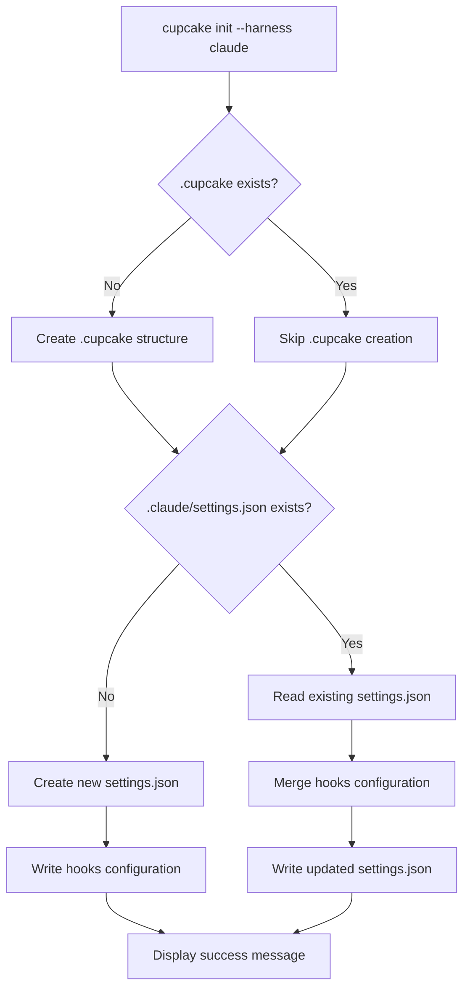

# Cupcake Init Harness Integration Specification

**Document Version**: 1.0  
**Status**: Ready for Implementation  
**Created**: 2025-09-07  

## Executive Summary

Add a `--harness` flag to the `cupcake init` command that automatically configures agent harness integrations (initially Claude Code) by creating or updating the appropriate settings files with hook configurations.

## Motivation

Currently, users must manually create and configure `.claude/settings.json` files to integrate Cupcake with Claude Code. This process is error-prone and creates friction in adoption. By automating this configuration, we improve user experience and ensure correct integration setup.

## Design Principles

1. **Simplicity**: Straightforward flag with clear behavior
2. **Safety**: Never destructively overwrite existing configurations
3. **Extensibility**: Easy to add new harness types in the future
4. **Idempotency**: Running multiple times produces consistent results
5. **Transparency**: Clear user feedback about what was created/modified
6. **Zero Dependencies**: Use only serde_json, no additional JSON manipulation libraries

## User Interface

### Command Syntax

```bash
# Initialize project with Claude Code integration
cupcake init --harness claude

# Initialize global config with Claude Code integration  
cupcake init --global --harness claude

# Initialize project without harness integration (default)
cupcake init
```

### Supported Harness Values

- `claude` - Claude Code (claude.ai/code)
- Future: `cursor`, `copilot`, `aider`, etc.

## Implementation Architecture

### 1. Command Line Interface

Update the `Init` command in `cupcake-cli/src/main.rs`:

```rust
#[derive(Parser, Debug)]
enum Command {
    /// Initialize a new Cupcake project
    Init {
        /// Initialize global (machine-wide) configuration instead of project
        #[clap(long)]
        global: bool,
        
        /// Configure integration with an agent harness (e.g., 'claude')
        #[clap(long, value_enum)]
        harness: Option<HarnessType>,
    },
    // ...
}

#[derive(Debug, Clone, ValueEnum)]
enum HarnessType {
    /// Claude Code (claude.ai/code)
    Claude,
    // Future harnesses can be added here
}
```

### 2. Harness Configuration Module

Create `cupcake-cli/src/harness.rs`:

```rust
pub trait HarnessConfig {
    /// Get the harness name for display
    fn name(&self) -> &str;
    
    /// Get the settings file path relative to project root
    fn settings_path(&self, global: bool) -> PathBuf;
    
    /// Generate the hook configuration JSON
    fn generate_hooks(&self, policy_dir: &Path) -> Result<serde_json::Value>;
    
    /// Merge hooks into existing settings
    fn merge_settings(&self, existing: serde_json::Value, hooks: serde_json::Value) -> Result<serde_json::Value>;
}
```

### 3. Claude Code Implementation

```rust
pub struct ClaudeHarness;

impl HarnessConfig for ClaudeHarness {
    fn name(&self) -> &str {
        "Claude Code"
    }
    
    fn settings_path(&self, global: bool) -> PathBuf {
        if global {
            dirs::home_dir()
                .unwrap()
                .join(".claude")
                .join("settings.json")
        } else {
            Path::new(".claude").join("settings.json")
        }
    }
    
    fn generate_hooks(&self, policy_dir: &Path) -> Result<serde_json::Value> {
        // Convert policy_dir to absolute path for the command
        let abs_policy_dir = std::fs::canonicalize(policy_dir)?;
        
        // Determine if we should use global or project policies
        let policy_path = if policy_dir.starts_with(dirs::home_dir().unwrap()) {
            // Global config - use absolute path
            abs_policy_dir.display().to_string()
        } else {
            // Project config - use project-relative path with env var
            "$CLAUDE_PROJECT_DIR/.cupcake".to_string()
        };
        
        Ok(json!({
            "hooks": {
                "PreToolUse": [{
                    "matcher": "*",
                    "hooks": [{
                        "type": "command",
                        "command": format!("cupcake eval --policy-dir {}", policy_path)
                    }]
                }],
                "PostToolUse": [{
                    "matcher": "Edit|MultiEdit|Write",
                    "hooks": [{
                        "type": "command",
                        "command": format!("cupcake eval --policy-dir {}", policy_path)
                    }]
                }],
                "UserPromptSubmit": [{
                    "hooks": [{
                        "type": "command",
                        "command": format!("cupcake eval --policy-dir {}", policy_path)
                    }]
                }],
                "SessionStart": [{
                    "hooks": [{
                        "type": "command",
                        "command": format!("cupcake eval --policy-dir {}", policy_path)
                    }]
                }]
            }
        }))
    }
    
    fn merge_settings(&self, existing: serde_json::Value, new_hooks: serde_json::Value) -> Result<serde_json::Value> {
        // Smart merge logic - see JSON Merge Strategy section
    }
}
```

### Hook Events Selection Rationale

The Claude Code integration configures these specific hooks:

1. **PreToolUse (all tools)**: Primary security gate - evaluates all tool uses before execution
2. **PostToolUse (Edit/Write only)**: Validates file modifications after they occur
3. **UserPromptSubmit**: Allows prompt validation and context injection
4. **SessionStart**: Loads project-specific context and policies at session start

These provide comprehensive coverage while minimizing performance impact.

## JSON Merge Strategy

### Rules for Safe Merging

1. **Never overwrite existing hooks** - Preserve user customizations
2. **Check for duplicates** - Don't add the same command twice
3. **Append to arrays** - Add new matchers to existing hook events
4. **Preserve all other settings** - Don't touch unrelated configuration

### Merge Algorithm

```rust
fn merge_hooks(existing: &mut Value, new: Value) -> Result<()> {
    // Get or create hooks object
    let hooks = existing
        .as_object_mut()
        .ok_or_else(|| anyhow!("Invalid settings format"))?
        .entry("hooks")
        .or_insert_with(|| json!({}));
    
    let new_hooks = new["hooks"].as_object()
        .ok_or_else(|| anyhow!("Invalid hooks format"))?;
    
    // For each event type in new hooks
    for (event_name, new_matchers) in new_hooks {
        let event_array = hooks
            .as_object_mut()
            .unwrap()
            .entry(event_name)
            .or_insert_with(|| json!([]))
            .as_array_mut()
            .ok_or_else(|| anyhow!("Invalid event array"))?;
        
        // Check if this exact configuration already exists
        for new_matcher in new_matchers.as_array().unwrap() {
            if !contains_matcher(event_array, new_matcher) {
                event_array.push(new_matcher.clone());
            }
        }
    }
    
    Ok(())
}

fn contains_matcher(array: &Vec<Value>, matcher: &Value) -> bool {
    // Deep comparison to avoid duplicates
    array.iter().any(|existing| {
        existing.get("matcher") == matcher.get("matcher") &&
        existing.get("hooks") == matcher.get("hooks")
    })
}
```

## File System Operations

### Creating New Settings File

```rust
fn create_settings_file(path: &Path, content: Value) -> Result<()> {
    // Ensure parent directory exists
    if let Some(parent) = path.parent() {
        fs::create_dir_all(parent)?;
    }
    
    // Write with pretty formatting
    let json_str = serde_json::to_string_pretty(&content)?;
    fs::write(path, json_str)?;
    
    Ok(())
}
```

### Updating Existing Settings File

```rust
fn update_settings_file(path: &Path, updater: impl FnOnce(&mut Value) -> Result<()>) -> Result<()> {
    // Read existing content
    let content = fs::read_to_string(path)?;
    let mut json: Value = serde_json::from_str(&content)?;
    
    // Apply updates
    updater(&mut json)?;
    
    // Write back with pretty formatting
    let json_str = serde_json::to_string_pretty(&json)?;
    fs::write(path, json_str)?;
    
    Ok(())
}
```

## User Feedback

### Success Messages

```
✅ Initialized Cupcake project in .cupcake/
✅ Configured Claude Code integration in .claude/settings.json
   - Added PreToolUse hook for all tools
   - Added UserPromptSubmit hook for prompt validation
   
   Claude Code will now evaluate all tool uses and prompts against your Cupcake policies.
```

### Warning Messages

```
⚠️  Found existing .claude/settings.json
   Merging Cupcake hooks into existing configuration...
   ✅ Successfully added Cupcake hooks without modifying other settings
```

### Error Messages

```
❌ Failed to configure Claude Code integration:
   Could not write to .claude/settings.json: Permission denied
   
   To manually configure, add this to your .claude/settings.json:
   {
     "hooks": {
       "PreToolUse": [{
         "matcher": "*",
         "hooks": [{
           "type": "command",
           "command": "cupcake eval --policy-dir /path/to/.cupcake"
         }]
       }]
     }
   }
```

## Integration Flow



## Testing Strategy

### Unit Tests

1. **Hook generation** - Verify correct JSON structure
2. **Path resolution** - Test absolute path conversion
3. **Merge logic** - Test various merge scenarios
4. **Duplicate detection** - Ensure no duplicate hooks

### Integration Tests

1. **Fresh init** - Create both .cupcake and .claude directories
2. **Existing .cupcake** - Only create .claude configuration
3. **Existing settings** - Merge without destroying existing config
4. **Global mode** - Verify ~/.claude/settings.json creation
5. **Idempotency** - Running twice produces same result

### Manual Testing Checklist

- [ ] Init with --harness claude creates valid settings.json
- [ ] Claude Code recognizes and uses the hooks
- [ ] Existing hooks are preserved during merge
- [ ] Error messages are helpful when operations fail
- [ ] Global and project modes work correctly

## Edge Cases and Error Handling

### Scenarios to Handle

1. **Malformed existing JSON**: If `.claude/settings.json` contains invalid JSON
   - Show clear error message with line number if possible
   - Suggest backing up and provide manual configuration instructions

2. **Write permissions**: If unable to write to `.claude/` directory
   - Check permissions before attempting write
   - Provide sudo instructions if appropriate
   - Show manual configuration as fallback

3. **Cupcake not in PATH**: When generating hook commands
   - Use full path to current cupcake binary
   - Or detect and use cupcake from PATH
   - Warn if neither is available

4. **Relative vs Absolute paths**: Policy directory references
   - Always convert to absolute paths in hook commands
   - Handle symlinks correctly with `canonicalize()`

5. **Existing Cupcake hooks**: If settings already contain cupcake commands
   - Detect by command pattern matching
   - Update path if different
   - Skip if identical

### Error Recovery

```rust
fn configure_harness(harness: HarnessType, policy_dir: &Path) -> Result<()> {
    match harness {
        HarnessType::Claude => {
            let claude = ClaudeHarness;
            let settings_path = claude.settings_path(global);
            
            // Try to configure, fallback to manual instructions
            if let Err(e) = setup_claude_settings(&claude, &settings_path, policy_dir) {
                eprintln!("⚠️  Could not automatically configure {}: {}", claude.name(), e);
                print_manual_instructions(&claude, policy_dir);
                // Don't fail the entire init
                return Ok(());
            }
        }
    }
    Ok(())
}
```

## Security Considerations

1. **Path Injection**: Always use `canonicalize()` for paths in commands
2. **JSON Injection**: Use serde_json for all JSON operations
3. **File Permissions**: Respect existing file permissions
4. **Command Safety**: Commands use full paths to cupcake binary
5. **Hook Command Validation**: Ensure generated commands are properly escaped

## Future Enhancements

1. **Multiple Harnesses**: Support comma-separated list `--harness claude,cursor`
2. **Custom Templates**: Allow users to provide hook templates
3. **Harness Removal**: Add `--remove-harness` flag
4. **Verification**: Add command to verify harness integration
5. **Auto-detection**: Detect harness from environment

## Implementation Checklist

- [ ] Add HarnessType enum to CLI parser
- [ ] Create harness module with trait definition
- [ ] Implement ClaudeHarness struct
- [ ] Add JSON merge utilities
- [ ] Update init_command functions
- [ ] Add unit tests for merge logic
- [ ] Add integration tests for init command
- [ ] Update documentation
- [ ] Add example to README

## Example Usage

### Basic Project Setup

```bash
# Initialize Cupcake with Claude Code integration
$ cupcake init --harness claude
✅ Initialized Cupcake project in .cupcake/
✅ Configured Claude Code integration in .claude/settings.json

# Verify the setup
$ cat .claude/settings.json
{
  "hooks": {
    "PreToolUse": [
      {
        "matcher": "*",
        "hooks": [
          {
            "type": "command",
            "command": "cupcake eval --policy-dir $CLAUDE_PROJECT_DIR/.cupcake"
          }
        ]
      }
    ],
    "PostToolUse": [
      {
        "matcher": "Edit|MultiEdit|Write",
        "hooks": [
          {
            "type": "command",
            "command": "cupcake eval --policy-dir $CLAUDE_PROJECT_DIR/.cupcake"
          }
        ]
      }
    ],
    "UserPromptSubmit": [
      {
        "hooks": [
          {
            "type": "command",
            "command": "cupcake eval --policy-dir $CLAUDE_PROJECT_DIR/.cupcake"
          }
        ]
      }
    ],
    "SessionStart": [
      {
        "hooks": [
          {
            "type": "command",
            "command": "cupcake eval --policy-dir $CLAUDE_PROJECT_DIR/.cupcake"
          }
        ]
      }
    ]
  }
}
```

### Global Setup for All Projects

```bash
# Initialize global Cupcake with Claude Code integration
$ cupcake init --global --harness claude
✅ Initialized global Cupcake configuration at ~/.config/cupcake
✅ Configured Claude Code integration in ~/.claude/settings.json

# Now all Claude Code projects will use your global Cupcake policies
```

## Conclusion

This specification provides a clean, extensible way to integrate Cupcake with agent harnesses. The initial implementation focuses on Claude Code, but the architecture supports easy addition of other harnesses. The design prioritizes safety and user experience while maintaining the simplicity that makes Cupcake approachable.