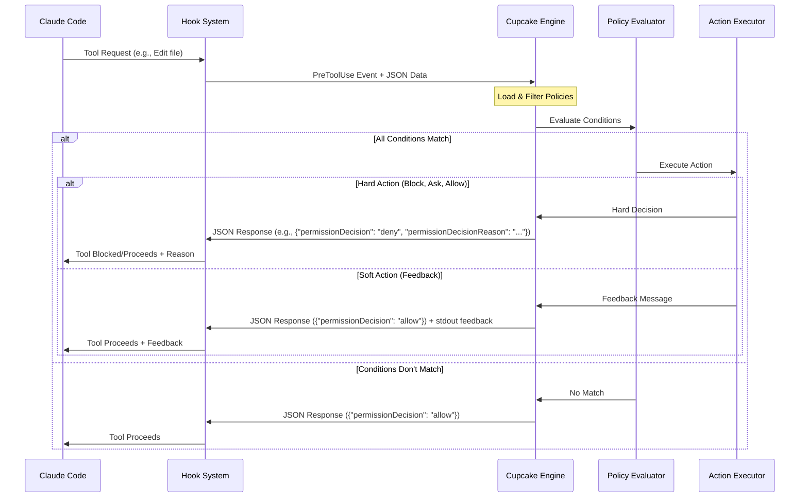
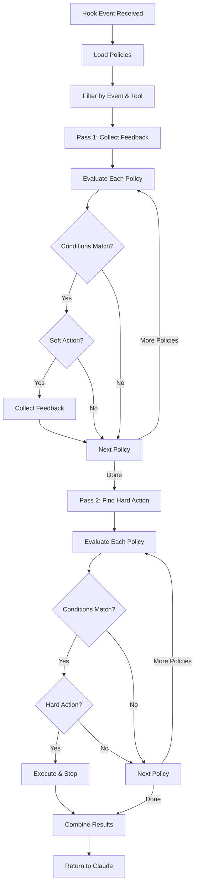
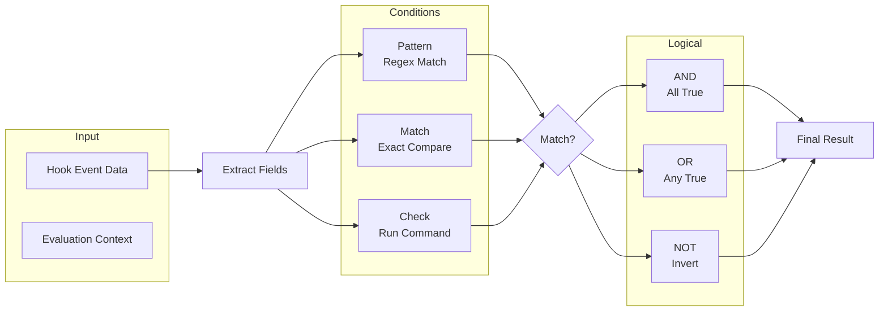
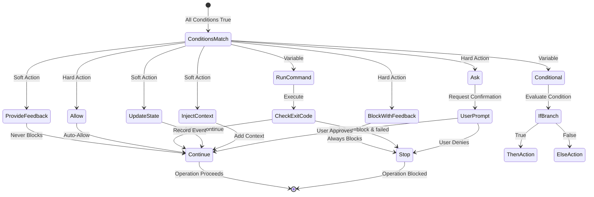
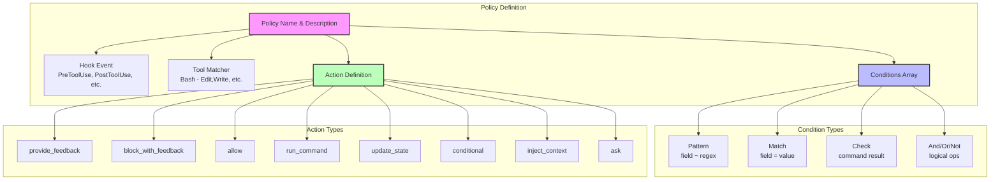

# Conditions and Actions

This guide explains the condition types (evaluations) and action types available in Cupcake policies.

## Quick Reference

### Condition Types

1. **pattern** - Regex matching on any field
2. **match** - Exact value comparison on any field
3. **check** - Run a command and check exit code
4. **state_query** - Query session state history
5. **and** - All conditions must be true
6. **or** - Any condition must be true
7. **not** - Inverts a condition

### Action Types

1. **provide_feedback** - Show message (never blocks)
2. **block_with_feedback** - Block operation with message
3. **allow** - Auto-allow (bypass permission prompt)
4. **run_command** - Execute a command
5. **update_state** - Record custom event to state
6. **conditional** - If/then/else based on a condition
7. **inject_context** - Inject context for UserPromptSubmit
8. **ask** - Ask user for confirmation

### When Actions Execute

Actions execute when **ALL conditions match** (implicit AND between conditions).

## Visual Overview

### Hook Lifecycle and Policy Execution



### Two-Pass Evaluation Model



### Condition Evaluation Flow



### Action Execution Types



### Policy Structure



## Detailed Guide

### Understanding Conditions

Conditions determine whether a policy applies to the current operation. Cupcake uses a simple 3-primitive model that can express any logic:

#### Pattern Condition

Matches field values using regular expressions.

```yaml
conditions:
  - type: "pattern"
    field: "tool_input.command"
    regex: "git\\s+commit"
```

Common fields:

- `tool_input.command` - Bash command being run
- `tool_input.file_path` - File being edited/written
- `tool_name` - Name of the tool (Bash, Write, Edit, etc.)
- `event_type` - Hook event (PreToolUse, PostToolUse, etc.)
- `prompt` - User's prompt text (UserPromptSubmit only)
- `env.VARIABLE` - Environment variables

#### Match Condition

Exact string comparison on any field.

```yaml
conditions:
  - type: "match"
    field: "tool_name"
    value: "Write"
```

#### Check Condition

Executes a command and evaluates based on exit code.

```yaml
conditions:
  - type: "check"
    spec:
      mode: array
      command: ["test", "-f", "package.json"]
    expect_success: true # true = exit 0 means match
```

Check conditions support three command modes:

- `array` - Most secure, no shell interpretation
- `string` - Shell-like syntax, parsed to array
- `shell` - Real shell execution (requires `allow_shell: true`)

See [Command Execution](command-execution.md) for details.

#### Logical Operators

Combine conditions with logical operators:

```yaml
conditions:
  - type: "and"
    conditions:
      - type: "pattern"
        field: "tool_input.file_path"
        regex: "\\.rs$"
      - type: "check"
        spec:
          mode: array
          command: ["cargo", "check", "--quiet"]
        expect_success: true

  - type: "or"
    conditions:
      - type: "match"
        field: "tool_name"
        value: "Write"
      - type: "match"
        field: "tool_name"
        value: "Edit"

  - type: "not"
    condition:
      type: "pattern"
      field: "tool_input.file_path"
      regex: "test"
```

### Understanding Actions

Actions define what happens when all conditions match.

#### Provide Feedback

Shows a message to Claude without blocking the operation. Used for suggestions and reminders.

```yaml
action:
  type: "provide_feedback"
  message: "Remember to run tests before committing!"
  include_context: false # Whether to include tool details
```

#### Block with Feedback

Prevents the operation by returning a JSON response with `permissionDecision: "deny"`. The feedback message is sent to Claude, which will try to correct its action.

```yaml
action:
  type: "block_with_feedback"
  feedback_message: "Tests must pass before committing. Run 'cargo test' first."
  include_context: true
```

#### Allow

Auto-allows the tool use by returning a JSON response with `permissionDecision: "allow"`. This bypasses Claude Code's permission prompt. The optional `reason` is shown to the user.

```yaml
action:
  type: "allow"
  reason: "Auto-allowed: editing test files" # Shown to user
```

#### Ask

Pauses the operation and prompts the end-user for explicit permission by returning a JSON response with `permissionDecision: "ask"`. This is useful for actions that are potentially sensitive but not always prohibited.

```yaml
action:
  type: "ask"
  reason: "You are attempting to edit a production configuration file. Are you sure?"
```

#### Run Command

Executes a command. Can block based on the command's success/failure.

```yaml
action:
  type: "run_command"
  spec:
    mode: array
    command: ["cargo", "fmt", "--check"]
  on_failure: "block" # or "continue"
  on_failure_feedback: "Please run 'cargo fmt' to format the code"
  background: false # Run synchronously
```

The `on_failure` options:

- `"block"` - If command exits non-zero, block the operation
- `"continue"` - Run command but don't block on failure

#### Update State

Records custom events to Cupcake's state system for use in future conditions.

```yaml
action:
  type: "update_state"
  event: "DatabaseMigrationRun"
  data:
    version: "1.2.3"
    timestamp: "{{now}}"
```

Note: Tool usage (Read, Write, Bash, etc.) is automatically tracked. Use update_state only for custom business logic events.

#### Conditional

Executes different actions based on a condition.

```yaml
action:
  type: "conditional"
  if:
    type: "check"
    spec:
      mode: array
      command: ["test", "-f", ".env.production"]
    expect_success: true
  then:
    type: "block_with_feedback"
    feedback_message: "Production environment detected. Manual approval required."
  else:
    type: "allow"
    reason: "Development environment - auto-allowed"
```

#### Inject Context

Injects additional context into Claude's prompt processing for UserPromptSubmit events. The context is provided to Claude to help guide its response.

```yaml
action:
  type: "inject_context"
  context: |
    Important: The user is working in a production environment.
    Please double-check any destructive operations.
  use_stdout: true  # Use stdout method (default) or JSON method
```

### Execution Flow

1. **Hook Event** - Claude Code triggers a hook (PreToolUse, PostToolUse, etc.)
2. **Policy Matching** - Policies are filtered by event type and tool matcher
3. **Condition Evaluation** - All conditions must evaluate to true
4. **Action Execution** - The action runs if conditions match
5. **Response** - Cupcake returns JSON response to Claude Code

### Two-Pass Evaluation

Cupcake uses a two-pass model to provide comprehensive feedback:

1. **Pass 1**: Collects all `provide_feedback` messages
2. **Pass 2**: Finds the first hard action (`block_with_feedback`, `allow`, `ask`, etc.)

This ensures Claude receives all relevant feedback, not just the first match.

### Examples

#### Example 1: Enforce Code Formatting

```yaml
PreToolUse:
  "Edit|Write":
    - name: "Rust formatting check"
      conditions:
        - type: "pattern"
          field: "tool_input.file_path"
          regex: "\\.rs$"
      action:
        type: "run_command"
        spec:
          mode: array
          command: ["cargo", "fmt", "--check", "--", "{{tool_input.file_path}}"]
        on_failure: "block"
        on_failure_feedback: "Please format with 'cargo fmt' first"
```

#### Example 2: Prevent Accidental Deletions

```yaml
PreToolUse:
  "Bash":
    - name: "Dangerous command protection"
      conditions:
        - type: "pattern"
          field: "tool_input.command"
          regex: "^rm\\s+(-rf?\\s+)?/"
      action:
        type: "block_with_feedback"
        feedback_message: "Deleting from root directory blocked. Please verify this command."
        include_context: true
```

#### Example 3: Context-Aware Approval

```yaml
PreToolUse:
  "Write":
    - name: "Auto-allow test files"
      conditions:
        - type: "pattern"
          field: "tool_input.file_path"
          regex: "(\\.test\\.|_test\\.|/tests?/)"
      action:
        type: "allow"
        reason: "Test file modification auto-allowed"
```

### Field Reference

Common fields available in conditions:

**All Events:**

- `event_type` - The hook event name
- `session_id` - Unique session identifier
- `env.*` - Environment variables (e.g., `env.USER`)

**Tool Events (PreToolUse/PostToolUse):**

- `tool_name` - Tool being invoked (Bash, Write, Edit, etc.)
- `tool_input.*` - Tool-specific inputs:
  - `tool_input.command` - Bash command
  - `tool_input.file_path` - File path for Write/Edit
  - `tool_input.content` - File content for Write
  - `tool_input.description` - Command description

**UserPromptSubmit:**

- `prompt` - The user's input text

### Template Variables

Use template variables in action messages and command arguments:

- `{{tool_name}}` - Current tool name
- `{{tool_input.file_path}}` - File being edited
- `{{session_id}}` - Current session ID
- `{{now}}` - Current timestamp
- `{{env.USER}}` - Environment variables

Templates are **not** allowed in command paths for security reasons.
