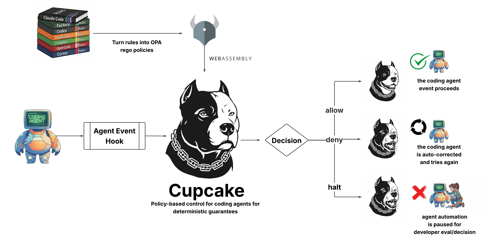

## Introduction

Cupcake is a guard dog (more specifically, a policy enforcement layer) for AI coding agents that delivers better performance, reliability, and security _without_ consuming model context.

- **Deterministic rule-following** for your agents
- **Better performance** by moving rules out of context and into guarantees
- **Trigger alerts** when agents repeatedly violate rules
- **LLM-as-a-judge** for more dynamic governance

Cupcake intercepts agent tool calls and evaluates them against user-defined rules written in [Open Policy Agent (OPA) Rego](https://www.openpolicyagent.org/). Agent actions can be blocked or auto-corrected, with reactive automation for tasks you don't need to rely on the agent to conduct.

## How It Works

Cupcake sits in the agent hook path. When an agent proposes an action (e.g., run a shell command, edit a file), the details are sent to Cupcake. Cupcake evaluates your policies and returns a decision in milliseconds:

**Allow** · **Deny** · **Halt**

A core pillar of Cupcake is **deterministic guarantees**—policies that always behave the same way given the same input. However, the nature of AI and where it's headed requires more dynamic policy gating. Agents can be prompted, confused, or manipulated in ways that static rules can't anticipate. That's why we developed [**Cupcake Watchdog**](/watchdog/getting-started.md), a built-in feature that uses LLM-as-a-judge to evaluate your rules and context and make intelligent determinations on the fly.

## Getting Started

Install Cupcake and set up your first policy in minutes. Check out our [Installation Guide](/getting-started/installation.md) to get started.

### Core Capabilities

- **Block specific tool calls:** Prevent use of particular tools or arguments based on policy
- **Behavioral guidance:** Inject lightweight, contextual reminders back to the agent
- **MCP support:** Govern Model Context Protocol tools (e.g., `mcp__memory__*`, `mcp__github__*`)
- **Signals (real-time context):** Pull facts from the environment (current Git branch, changed files, deployment target) and make policy decisions on them

### Key Features

- **Fast evaluation** - Sub-millisecond for cached policies in typical setups
- **No token consumption** - Policies run outside the model and return structured decisions
- **Model-agnostic** - Works with any AI coding agent through harness-specific integrations
- **Sandboxed execution** - Policies are compiled to WebAssembly and run in a secure sandbox
- **Extensible signals** - Gather real-time context from Git, CI, DB metadata, feature flags, and more

## Supported Harnesses

Cupcake provides native integrations for multiple AI coding agents:

| Harness                                   | Status                         | Integration Guide                                    |
| ----------------------------------------- | ------------------------------ | ---------------------------------------------------- |
| **[Claude Code](https://claude.ai/code)** | :lucide-check: Fully Supported | [Setup Guide](/getting-started/usage/claude-code.md) |
| **[Cursor](https://cursor.com)**          | :lucide-check: Fully Supported | [Setup Guide](/getting-started/usage/cursor.md)      |
| **[OpenCode](https://opencode.ai/)**      | :lucide-check: Fully Supported | [Setup Guide](/getting-started/usage/opencode.md)    |
| **[Factory AI](https://factory.ai/)**     | :lucide-check: Fully Supported | [Setup Guide](/getting-started/usage/factory-ai.md)  |

Each harness uses native event formats—no normalization layer. Policies are physically separated by harness (`policies/claude/`, `policies/cursor/`) to ensure clarity and full access to harness-specific capabilities.

## Language Bindings

Cupcake can be embedded in Python or JavaScript agent applications through native bindings. This enables integration with web-based agent frameworks like LangChain, Google ADK, NVIDIA NIM, Vercel AI SDK, and more.

| Language                                                      | Binding            |
| ------------------------------------------------------------- | ------------------ |
| { width="24" } Python             | `cupcake`          |
| { width="24" } TypeScript | `@eqtylab/cupcake` |

## Why Cupcake?

Modern AI agents are powerful but inconsistent at following operational and security rules, especially as context grows. Cupcake turns the rules you already maintain (e.g., `CLAUDE.md`, `AGENT.md`, `.cursor/rules`) into enforceable guardrails that run before actions execute.

- **Multi-harness support** with first-class integrations for Claude Code and Cursor
- **Governance-as-code** using OPA/Rego compiled to WebAssembly for fast, sandboxed evaluation
- **Enterprise-ready controls:** allow/deny/review, audit trails, and proactive warnings

## Built By

Cupcake is developed by [EQTYLab](https://eqtylab.io/), with agentic safety research support by [Trail of Bits](https://www.trailofbits.com/).
