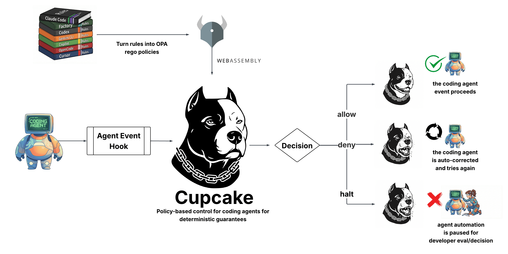
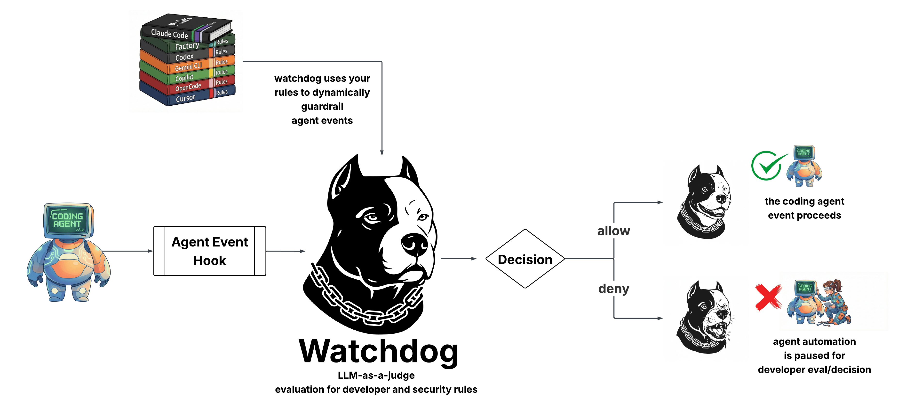

# Determinism

Cupcake supports both **deterministic** and **non-deterministic** guardrails, giving you the flexibility to choose the right level of governance for your use case.

## Deterministic Guardrails

Deterministic policies always produce the same output given the same input. They are:

- **Predictable** – Same input, same result, every time
- **Fast** – Sub-millisecond evaluation via WebAssembly
- **Auditable** – Clear reasoning chain for compliance
- **Reliable** – No external dependencies at runtime

Use deterministic policies for hard requirements: blocking dangerous commands, protecting sensitive paths, enforcing workflow rules.

## Non-Deterministic Guardrails (Watchdog)

Non-deterministic policies use LLM-as-a-judge to evaluate actions semantically. They are:

- **Adaptive** – Catches novel threats without new rules
- **Context-aware** – Understands intent, not just patterns
- **Flexible** – Evaluates against your existing rules files
- **Complementary** – Works alongside deterministic policies

Use non-deterministic policies for semantic analysis: detecting misaligned actions, flagging suspicious patterns, evaluating against project-specific guidelines.
