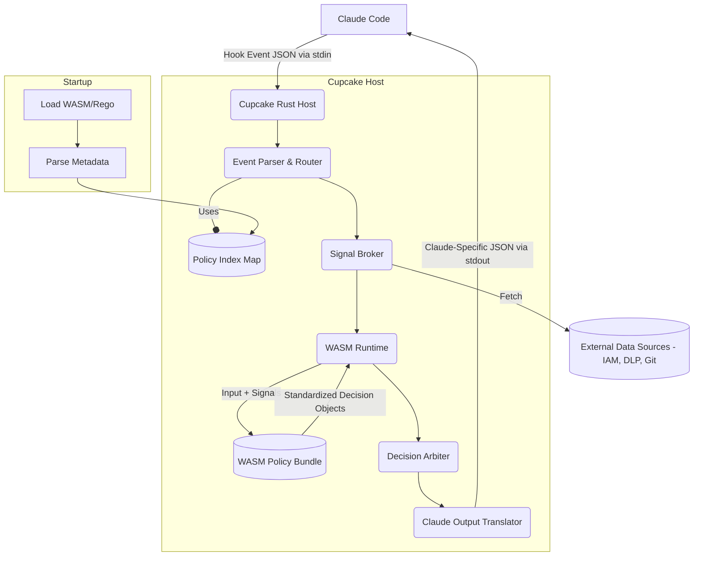

## Cupcake Policy Architecture Diagram

```mermaid
graph TD
    A[Claude Code] -->|Hook Event JSON via stdin| B(Cupcake Rust Host);

    subgraph Cupcake Host
        B --> C(Event Parser & Router);
        C --o|Uses| D[(Policy Index Map)];
        C --> E(Signal Broker);
        E --> G(WASM Runtime);
        G -->|Input + Signals| H[(WASM Policy Bundle)];
        H -->|Standardized Decision Objects| G;
        G --> I(Decision Arbiter);
        I --> J(Claude Output Translator);
    end

    E -->|Fetch| F[(External Data Sources - IAM, DLP, Git)];
    J -->|Claude-Specific JSON via stdout| A;

    subgraph Startup
        S1[Load WASM/Rego] --> S2[Parse Metadata];
        S2 --> D;
    end
```
