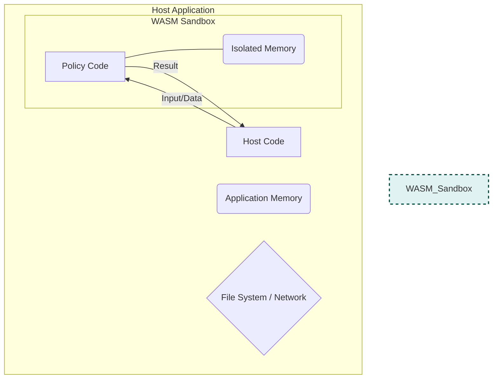
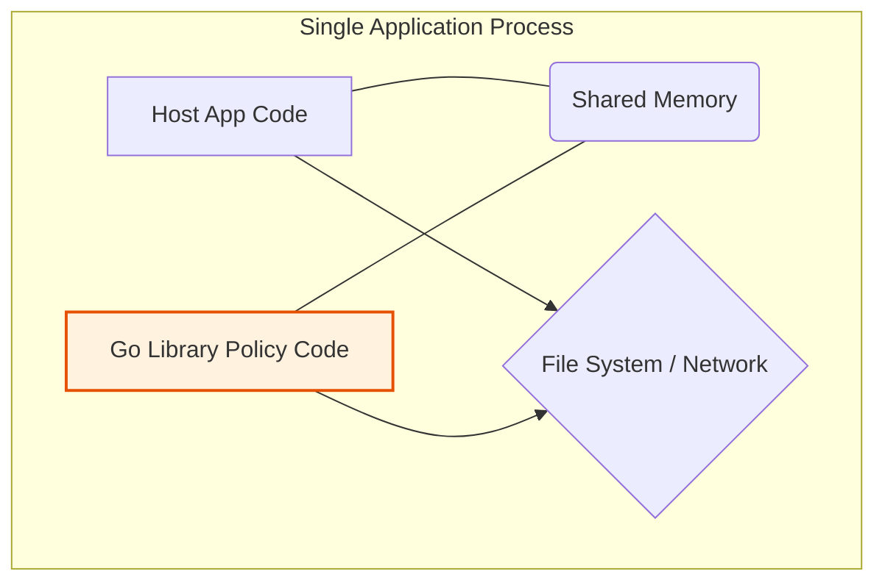

Security is a major benefit of using WASM because it runs code in a **sandboxed environment**, which is fundamentally different from how a standard Go library operates.

The core difference is the principle of **trust**. WASM operates on a "deny-by-default" model, while a Go library operates on a "trust-by-default" model.

---

### The WASM Security Model: A "Deny-by-Default" Sandbox 📦

Think of a WASM module as code running inside a sealed, padded room with no windows or doors. It can't see, hear, or touch anything in the outside world (your application).

- **Memory Isolation:** The WASM module has its own dedicated block of memory. It is physically incapable of reading or writing to the memory of the host application. It can't snoop on your app's data or crash it by corrupting memory.
- **Capability-Based Permissions:** By default, the WASM module can do nothing but perform calculations. It cannot open files, make network calls, or access any system resources. The host application must explicitly grant it any "capabilities" by passing in functions that the WASM module is allowed to call. In the case of OPA, the host passes in the `input` and `data`, and the WASM module gives back the policy `result`. That's it.

This makes it safe to run policy code that you don't fully trust. A poorly written or even malicious policy can't escape the sandbox to harm your application.

---

### The OPA Go Library Model: A "Trust-by-Default" Partnership 🤝

When you import a Go library into your Go program, it's like letting a coworker use your computer. The library's code runs in the **same process** and shares the **same memory space** as your application.

- **Shared Permissions:** The library has all the same permissions as your application. If your program has the ability to read files from the disk or send data over the network, so does the library code you imported.
- **Implicit Trust:** There is no security boundary. You are implicitly trusting that the library's code (and all of _its_ dependencies) is well-behaved and free of vulnerabilities. A bug or malicious code in a library could potentially read sensitive data from your application's memory or perform unauthorized actions.

---

### Why This Matters for Rego Policies

This security distinction is critical when policies can be loaded dynamically. Imagine your platform allows different teams to upload their own Rego policies for enforcement.

- If you run these policies as **WASM**, a policy author could write a rule that tries to `http.send()` a request to an external server or read `/etc/shadow`. The attempt would simply fail because the sandbox doesn't grant those capabilities. Your application remains secure.
- If you were using a library that evaluated raw Rego and had a vulnerability, that same malicious policy code could potentially execute with the full permissions of your host application, creating a major security risk.

In short, **WASM provides a strong security guarantee by isolating untrusted code**, whereas a native library requires you to fully trust the code you are running.

---

### 1. The Secure Sandbox Model (WASM)

This diagram shows the **"deny-by-default"** model. The policy code is sealed inside a sandbox with its own isolated memory. It cannot access anything in the host application (like memory, files, or the network) unless explicitly given data through a controlled channel.

---

### 2. The Shared Trust Model (Go Library)

This diagram illustrates the **"trust-by-default"** model. The library's policy code runs in the same process as the host application. Both share the same memory and have the same permissions to access system resources. There is no security boundary between them.

