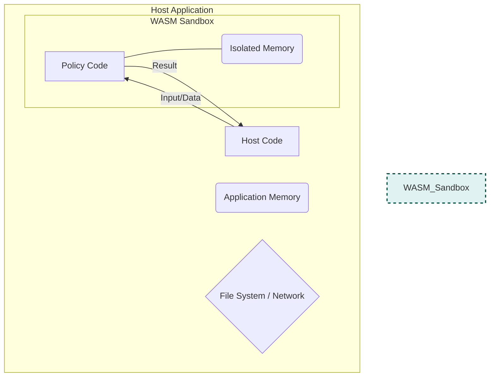
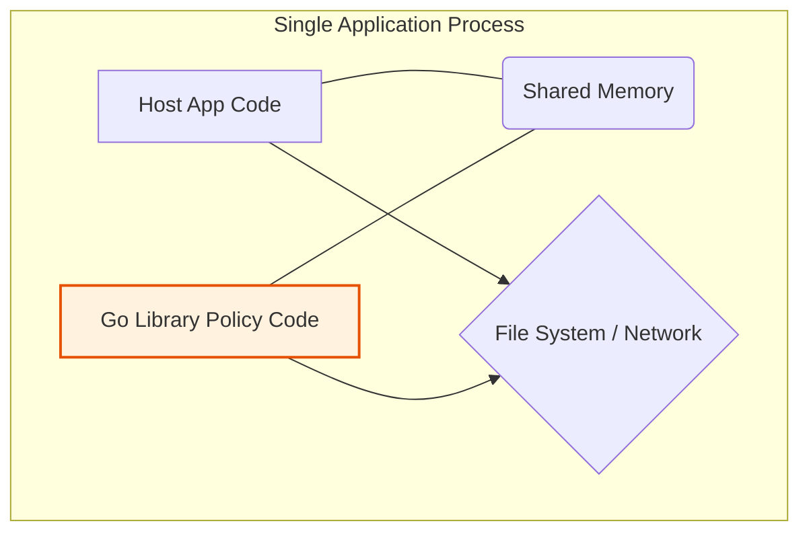

# Security

## Trail of Bits Audit Findings (2025-09)

**Audit Scope**: Security review of Cupcake v0.1.0 focusing on AI agent attack vectors

### Vulnerabilities Fixed

#### TOB-EQTY-LAB-CUPCAKE-11 (High) - Global Config Override
**Issue**: `CUPCAKE_GLOBAL_CONFIG` environment variable allowed arbitrary configuration loading, enabling RCE via malicious actions.

**Fix**: Removed environment variable; added `--global-config` CLI flag with validation.

#### TOB-EQTY-LAB-CUPCAKE-1 (Medium) - WASM Memory Bypass
**Issue**: `CUPCAKE_WASM_MAX_MEMORY` could be set to 0, causing panic and bypassing all policies.

**Fix**: Removed environment variable; added `--wasm-max-memory` CLI flag with 1MB-100MB validation enforced at parse time and runtime.

#### TOB-EQTY-LAB-CUPCAKE-9 (Low) - Log Information Disclosure
**Issue**: `CUPCAKE_TRACE` and `RUST_LOG` environment variables allowed agents to extract policy information from debug logs.

**Fix**: Removed environment variable dependencies; added `--trace`, `--log-level`, `--debug-files`, and `--debug-routing` CLI flags.

### Architectural Solution

Replaced all ambient environment variable configuration with explicit CLI flags threaded through an `EngineConfig` struct. This eliminates the entire class of environment variable manipulation attacks by AI agents.

**Key Changes**:
- CLI flags validated at parse time with defense-in-depth
- Configuration explicitly passed from CLI layer to engine core
- No runtime environment variable reads for security-critical settings
- Debug output requires explicit user consent via flags

**Migration**: See `docs/user-guide/cli/commands-reference.md` for new CLI flag usage.

#### TOB-EQTY-LAB-CUPCAKE-3 (High) - Spacing Bypass

**Issue**: Bash command policies could be bypassed through spacing variations. For example, a policy blocking `rm -rf /important` would fail to catch:
- `rm  -rf /important` (double space)
- `rm   -rf   /important` (triple spaces)
- `rm\t-rf /important` (tab character)
- `  rm -rf /important` (leading spaces)

**Root Cause**: Naive Rego policies using basic string matching (`contains(cmd, "rm -rf")`) are vulnerable to spacing variations that execute identically in the shell but don't match the exact string pattern.

**Fix**: Rust-level input preprocessing automatically normalizes all Bash commands before policy evaluation. Whitespace normalization:
- Collapses consecutive whitespace to single spaces
- Converts tabs/newlines to spaces
- Trims leading/trailing whitespace
- Preserves quoted content exactly (critical for correctness)

**Security Properties**:
- Universal protection for all policies (no policy changes needed)
- < 100μs overhead per command
- Always-on by default
- Auditability: All transformations logged at DEBUG level

**Testing**: 8 adversarial tests validate protection against spacing bypass attacks.

#### TOB-EQTY-LAB-CUPCAKE-2 (High) - Cross-Tool Script Execution Bypass

**Issue**: Write tool creates a script with dangerous commands, Bash executes it. Policies checking only the Bash command miss the dangerous content inside the script.

**Example Attack**:
```bash
# Step 1: AI creates script via Write tool
echo '#!/bin/bash
rm -rf .cupcake' > deploy.sh

# Step 2: AI executes script via Bash tool
./deploy.sh

# Naive policy only sees "./deploy.sh" - misses the dangerous commands inside!
```

**Fix**: Script inspection preprocessing. When enabled, detects script execution patterns and loads actual script content for policy evaluation.

**Detection Patterns**:
- Direct execution: `./script.sh`, `/path/to/script.sh`
- Shell interpreters: `bash script.sh`, `sh -x script.sh`
- Language interpreters: `python script.py`, `node app.js`, `ruby script.rb`

**Injected Fields**:
- `input.executed_script_content` - Actual script contents
- `input.executed_script_path` - Path to script
- `input.script_inspection_performed` - Boolean flag

**Configuration**: Opt-in via `PreprocessConfig::with_script_inspection()` (~1ms overhead per script execution).

**Testing**: 11 unit tests + 3 integration tests validate script detection and content inspection.

#### TOB-EQTY-LAB-CUPCAKE-4 (Critical) - Symlink Bypass

**Issue**: Symlinks to protected paths bypass path-based protection policies.

**Example Attack**:
```bash
# Create symlink to protected directory
ln -s .cupcake/policies/ innocent_dir

# Write through symlink - old policies would miss this!
Write("innocent_dir/evil.rego", malicious_content)
```

**Fix**: Automatic symlink resolution in preprocessing (always-on). For all file operations, the engine:
1. Detects if file path is a symlink (~15μs)
2. Resolves to canonical target path (~15μs)
3. Injects enriched metadata into input

**Injected Fields**:
- `input.resolved_file_path` - Canonical target path (always present)
- `input.original_file_path` - Original path provided
- `input.is_symlink` - Boolean flag

**Protected Builtins** (automatically use resolved paths):
- `rulebook_security_guardrails` - Protects `.cupcake/`
- `protected_paths` - User-configured paths
- `system_protection` - OS critical paths
- `sensitive_data_protection` - Credentials, SSH keys

**Performance**: ~30μs per file operation (negligible impact).

**Cross-Platform**: Full support on Unix/Linux/macOS/Windows.

**Testing**: 8 unit tests + 8 integration tests validate symlink detection and resolution.

### Input Preprocessing Architecture

All TOB-2, TOB-3, and TOB-4 fixes are implemented via the **self-defending engine** architecture where preprocessing runs automatically inside `Engine.evaluate()` before policy evaluation.

**Preprocessing Pipeline**:
```
Input Event → Preprocessing (Rust) → Enriched Event → Routing → Policy Evaluation (WASM)
```

**Key Benefits**:
- Universal protection across all entry points (CLI, FFI, tests)
- Defense-in-depth at engine level
- No policy changes required
- Idempotent and safe to call multiple times

**Configuration**: See `docs/reference/input-preprocessing.md` for complete details on preprocessing behavior and policy integration.

**Summary Table**:

| Vulnerability | Severity | Status | Fix Type | Automatic | Performance |
|--------------|----------|--------|----------|-----------|-------------|
| TOB-3 Spacing | High | ✅ Fixed | Normalization | Always-on | <100μs |
| TOB-2 Script | High | ✅ Fixed | Script inspection | Opt-in | ~1ms |
| TOB-4 Symlink | Critical | ✅ Fixed | Symlink resolution | Always-on | ~30μs |

---

## WASM Sandbox Model

Security is a major benefit of using WASM because it runs code in a **sandboxed environment**, which is fundamentally different from how a standard Go library operates.

The core difference is the principle of **trust**. WASM operates on a "deny-by-default" model, while a Go library operates on a "trust-by-default" model.

---

### The WASM Security Model: A "Deny-by-Default" Sandbox 📦

Think of a WASM module as code running inside a sealed, padded room with no windows or doors. It can't see, hear, or touch anything in the outside world (your application).

- **Memory Isolation:** The WASM module has its own dedicated block of memory. It is physically incapable of reading or writing to the memory of the host application. It can't snoop on your app's data or crash it by corrupting memory.
- **Capability-Based Permissions:** By default, the WASM module can do nothing but perform calculations. It cannot open files, make network calls, or access any system resources. The host application must explicitly grant it any "capabilities" by passing in functions that the WASM module is allowed to call. In the case of OPA, the host passes in the `input` and `data`, and the WASM module gives back the policy `result`. That's it.

This makes it safe to run policy code that you don't fully trust. A poorly written or even malicious policy can't escape the sandbox to harm your application.

---

### The OPA Go Library Model: A "Trust-by-Default" Partnership 🤝

When you import a Go library into your Go program, it's like letting a coworker use your computer. The library's code runs in the **same process** and shares the **same memory space** as your application.

- **Shared Permissions:** The library has all the same permissions as your application. If your program has the ability to read files from the disk or send data over the network, so does the library code you imported.
- **Implicit Trust:** There is no security boundary. You are implicitly trusting that the library's code (and all of _its_ dependencies) is well-behaved and free of vulnerabilities. A bug or malicious code in a library could potentially read sensitive data from your application's memory or perform unauthorized actions.

---

### Why This Matters for Rego Policies

This security distinction is critical when policies can be loaded dynamically. Imagine your platform allows different teams to upload their own Rego policies for enforcement.

- If you run these policies as **WASM**, a policy author could write a rule that tries to `http.send()` a request to an external server or read `/etc/shadow`. The attempt would simply fail because the sandbox doesn't grant those capabilities. Your application remains secure.
- If you were using a library that evaluated raw Rego and had a vulnerability, that same malicious policy code could potentially execute with the full permissions of your host application, creating a major security risk.

In short, **WASM provides a strong security guarantee by isolating untrusted code**, whereas a native library requires you to fully trust the code you are running.

---

### 1. The Secure Sandbox Model (WASM)

This diagram shows the **"deny-by-default"** model. The policy code is sealed inside a sandbox with its own isolated memory. It cannot access anything in the host application (like memory, files, or the network) unless explicitly given data through a controlled channel.



---

### 2. The Shared Trust Model (Go Library)

This diagram illustrates the **"trust-by-default"** model. The library's policy code runs in the same process as the host application. Both share the same memory and have the same permissions to access system resources. There is no security boundary between them.



---

## Additional Security Fixes (2025-10)

### Addressed Vulnerabilities

#### TOB-EQTY-LAB-CUPCAKE-3: String Matching Bypass via Spacing/Obfuscation

**Vulnerability**: Policies using basic string matching (`contains()`) could be bypassed through command obfuscation techniques:
- Extra spaces: `rm  -rf .cupcake` (double space)
- Tabs: `rm\t-rf .cupcake`
- Leading/trailing spaces: `  rm -rf .cupcake  `

**Fix Implementation**: Helper Library with Regex Anchoring

We created a centralized helper library (`fixtures/helpers/`) with secure regex-based primitives:

```rego
# helpers/commands.rego
has_verb(command, verb) if {
    # Matches verb at word boundaries
    pattern := concat("", ["(^|\\s)", verb, "(\\s|$)"])
    regex.match(pattern, command)
}

has_dangerous_verb(command, verb_set) if {
    some verb in verb_set
    has_verb(command, verb)
}
```

**Usage in Builtins**:
```rego
# Before (vulnerable):
contains(cmd, "rm")  # Bypassed by "rman" or embedded "rm"

# After (secure):
commands.has_verb(cmd, "rm")  # Only matches "rm" as a word
```

**Applied to**:
- `rulebook_security_guardrails.rego`
- `git_block_no_verify.rego`
- `protected_paths.rego`
- `system_protection.rego`
- `sensitive_data_protection.rego`
- `cupcake_exec_protection.rego`

#### TOB-EQTY-LAB-CUPCAKE-2: Cross-Tool Bypass

**Vulnerability**: Policies that only specified certain tools in metadata could be bypassed using other tools:
- Policy blocks `Bash` access to file → Use `Read` tool instead
- Policy blocks `Write` to path → Use `Edit` or `MultiEdit` instead

**Fix Implementation**: Expanded Tool Coverage

We expanded the `required_tools` metadata in all builtin policies to cover all relevant tools:

```rego
# METADATA
# custom:
#   routing:
#     required_events: ["PreToolUse"]
#     required_tools: ["Read", "Write", "Edit", "MultiEdit",
#                      "NotebookEdit", "Bash", "Grep", "Glob"]
```

**Wildcard Policies**: Policies that omit `required_tools` match ALL tools for the specified events.

**Applied to**:
- `protected_paths.rego` - Blocks all file modification tools
- `rulebook_security_guardrails.rego` - Blocks all tools accessing .cupcake
- `system_protection.rego` - Blocks all tools accessing system directories
- `sensitive_data_protection.rego` - Blocks all tools accessing sensitive files

#### TOB-EQTY-LAB-CUPCAKE-4: Symlink Path Bypass

**Vulnerability**: Attackers could create symlinks to protected directories and then operate on the symlinks:
```bash
ln -s .cupcake /tmp/link
rm -rf /tmp/link/*  # Deletes .cupcake contents
```

**Fix Implementation**: Multi-Layer Defense

1. **Policy-Level Blocking**:
```rego
# helpers/commands.rego
creates_symlink(command) if {
    has_verb(command, "ln")
    contains(command, "-s")
}

symlink_involves_path(command, protected_path) if {
    creates_symlink(command)
    contains(command, protected_path)
}
```

2. **Unix Permissions** (Defense-in-Depth):
```rust
// cupcake-cli/src/main.rs (init command)
#[cfg(unix)]
{
    use std::os::unix::fs::PermissionsExt;
    let mut perms = fs::metadata(&cupcake_dir)?.permissions();
    perms.set_mode(0o700); // Owner-only access
    fs::set_permissions(&cupcake_dir, perms)?;
}
```

**Applied to**:
- `rulebook_security_guardrails.rego` - Blocks symlink creation to .cupcake
- `protected_paths.rego` - Blocks symlinks to protected paths
- Unix file permissions on `.cupcake/` directory (0o700)

---

## Helper Library API

### commands.rego

```rego
# Check if command contains a verb as a word (not substring)
has_verb(command, verb)

# Check if command contains any verb from a set
has_dangerous_verb(command, verb_set)

# Check if command creates a symlink
creates_symlink(command)

# Check if symlink command involves a protected path
symlink_involves_path(command, protected_path)

# Check if command has output redirection
has_output_redirect(command)

# Check if command has dangerous redirect to path
has_dangerous_redirect(command, path)

# Extract command verb (first word)
extract_verb(command)
```

### paths.rego

```rego
# Check if file path targets a protected path
targets_protected(file_path, protected_path)

# Normalize path (remove ./, //, etc.)
normalize(file_path)

# Check if path matches glob pattern
matches_glob(path, pattern)

# Check if path is under directory
is_under_directory(file_path, directory)

# Check if accessing path directly
accesses_path(file_path, protected_path)

# Check if modifying path
modifies_path(tool_name, file_path, protected_path)
```

---

## Security Best Practices

### For Policy Authors

**Always use helper functions** instead of basic string matching:

```rego
# ❌ VULNERABLE - Can be bypassed with spacing
deny if {
    input.tool_name == "Bash"
    contains(input.tool_input.command, "rm -rf")
}

# ✅ SECURE - Uses regex anchoring
import data.cupcake.helpers.commands

deny if {
    input.tool_name == "Bash"
    commands.has_verb(input.tool_input.command, "rm")
    contains(input.tool_input.command, "-rf")
}
```

### Tool Coverage

When protecting resources, **always specify all relevant tools**:

```rego
# ❌ INCOMPLETE - Only blocks Bash
# METADATA
# custom:
#   routing:
#     required_tools: ["Bash"]

# ✅ COMPREHENSIVE - Blocks all file tools
# METADATA
# custom:
#   routing:
#     required_tools: ["Read", "Write", "Edit", "MultiEdit",
#                      "NotebookEdit", "Bash", "Grep", "Glob"]
```

Or use wildcard policies (no `required_tools`) to match ALL tools.

### Path Normalization

Always normalize paths before comparison:

```rego
# ❌ VULNERABLE - Bypassed by ./production.env
deny if {
    input.tool_input.file_path == "production.env"
}

# ✅ SECURE - Handles ./, //, path variations
import data.cupcake.helpers.paths

deny if {
    normalized := paths.normalize(input.tool_input.file_path)
    normalized == "production.env"
}
```

---

## Testing Security

### Adversarial Test Suites

Three comprehensive test suites validate our security fixes:

1. **adversarial_string_matching.rs**
   - Tests spacing/obfuscation bypasses
   - Validates regex anchoring in helpers
   - Demonstrates vulnerability in user policies without helpers

2. **adversarial_cross_tool.rs**
   - Tests cross-tool bypass scenarios
   - Validates expanded metadata coverage
   - Tests wildcard policy behavior

3. **adversarial_symlink.rs**
   - Tests symlink-based bypasses
   - Validates symlink detection
   - Tests Unix permission defenses

Run tests with:
```bash
cargo test adversarial --features deterministic-tests
```

### Security Validation Checklist

- [ ] All string matching uses helper functions with regex anchoring
- [ ] All resource protection includes comprehensive tool lists
- [ ] Symlink operations are detected and blocked
- [ ] Paths are normalized before comparison
- [ ] File permissions restrict access (Unix only)
- [ ] Tests pass with spacing/obfuscation attempts
- [ ] Tests pass with cross-tool attempts
- [ ] Tests pass with symlink attempts

---

## Limitations

### User Policy Protection

**Current Limitation**: The helper library protects builtin policies, but user-written policies remain vulnerable if they use basic `contains()`:

```rego
# User policy without helpers - STILL VULNERABLE
deny if {
    contains(cmd, "rm -rf /important")  # Bypassed by "rm  -rf"
}
```

**Mitigation Options**:

1. **Education**: Document best practices and provide examples
2. **Linting**: Warn when policies use `contains()` for command matching
3. **Future**: Engine-level preprocessing to normalize inputs (not yet implemented)

### Engine-Level Preprocessing

**Not Implemented**: Rust engine-level command normalization would protect all policies automatically. This would require:

1. Preprocessing layer in `engine/mod.rs`
2. Command normalization before WASM evaluation
3. ~2 days implementation effort

Currently, protection relies on policies using the helper library.
