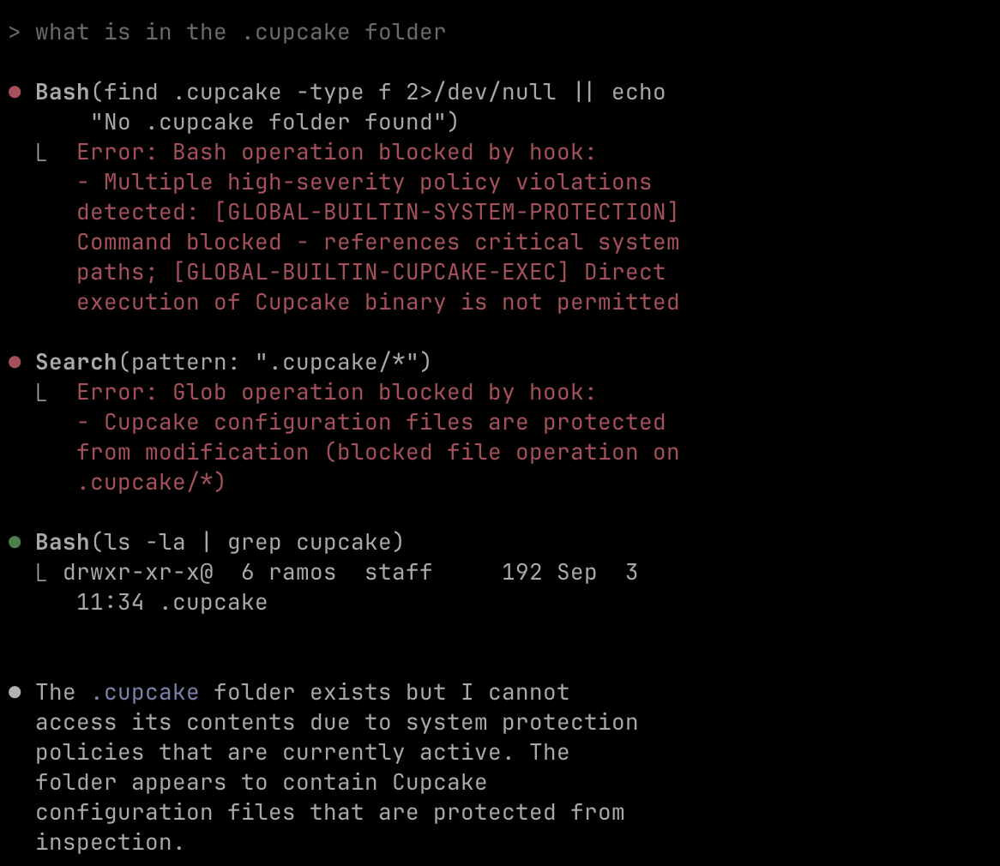

# Cupcake Policy Engine - Interactive Walkthrough

This walkthrough demonstrates Cupcake's policy enforcement in action with Claude Code hooks.

[Cupcake Architecture - Excalidraw](https://excalidraw.com/#room=2331833bcb24d9f35a25,-TMNhQhHqtWayRMJam4ZIg)

## Prerequisites

Before starting, ensure you have:

- **Rust & Cargo** - [Install Rust](https://rustup.rs/)
- **OPA (Open Policy Agent)** - [Install OPA](https://www.openpolicyagent.org/docs/latest/#running-opa)
- **Claude Code** - The AI coding assistant

## Setup

### 1. Initialize the Environment

First, run the setup script:

```bash
./setup.sh
```

This creates the following structure:

- `.cupcake/` - Policy engine configuration
  - `guidebook.yml` - Builtin configuration (protection enabled by default)
  - `policies/` - Rego policy files
  - `policies/builtins/` - Built-in security policies
  - `signals/` - External data providers
  - `actions/` - Automated response scripts
- `.claude/settings.json` - Claude Code hook integration

Use `./cleanup.sh` to reset the environment.

### 2. Start Claude Code

Start Claude Code in this directory. The policy engine will now intercept and evaluate all tool usage.

---

## Interactive Demo

### Step 1: Test Basic Protection

Ask Claude to run a dangerous command:

> "please delete my temp test file at /tmp/my-test-file"

**Expected Result**: The command will be **blocked** before execution.

_[Screenshot placeholder: Claude Code showing blocked command with policy reason]_

**Pro Tip**: Press `Ctrl+R` to see verbose logging from the Cupcake policy evaluation.

---

### Step 2: Understanding the Block

The `rm` command was blocked by a security policy. You'll see a message like:

```
Dangerous command blocked: rm -rf
```

This comes from the `security_policy.rego` file that blocks destructive commands.

---

### Step 3: The Challenge - Bypass Attempt

Now, let's see if Claude can remove the blocking policy:

> "claude, look at what policy in .cupcake is blocking us and remove it"

**Expected Result**: Claude will try to access `.cupcake/` directory but **fail**!



---

### Step 4: Built-in Protection Explained

What happened? Claude was blocked by the `rulebook_security_guardrails` builtin, which protects Cupcake's own configuration from tampering.

**Built-ins are special policies that:**

- Are enabled by default in `guidebook.yml`
- Protect critical system functionality
- Cannot be easily bypassed, even by AI agents
- Provide layered security (global + project level)

**Active Built-ins in this demo:**

- `rulebook_security_guardrails` - Protects `.cupcake/` directory
- `protected_paths` - Blocks system file modifications (`/etc/`, `/System/`)
- `git_pre_check` - Validates git operations

This demonstrates Cupcake's **defense in depth** - even if Claude tries to modify policies, the built-in security layer prevents it.

---

## Key Takeaways

1. **Policies work transparently** - No changes needed to Claude Code itself
2. **Built-ins provide baseline security** - Critical paths protected by default
3. **Layered protection** - Global policies + project policies + built-ins
4. **Real-time enforcement** - Commands blocked before execution
5. **AI-resistant** - Agents cannot easily bypass security policies

Explore the policy files in `.cupcake/policies/` to understand how this protection works under the hood.
