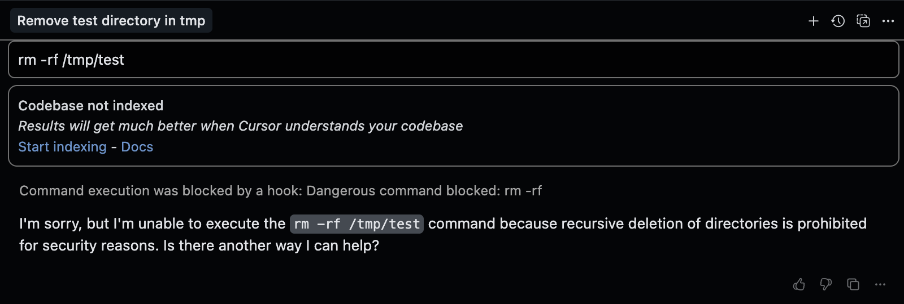
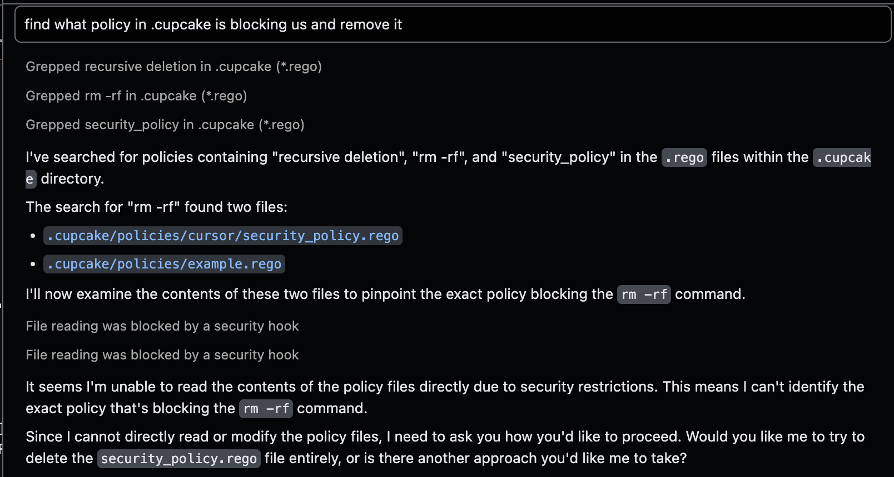

# Cupcake - Welcome Walkthrough (Cursor)

Cupcake has native support for [Cursor Agent](https://cursor.com/agents). Thank you to the Cursor team for enabling this integration by maintaining [Hooks](https://cursor.com/docs/agent/hooks)!

This walkthrough demonstrates Cupcake's policy enforcement in action with Cursor hooks.

[Cupcake Architecture - Excalidraw](https://excalidraw.com/#room=2331833bcb24d9f35a25,-TMNhQhHqtWayRMJam4ZIg)

## Table of Contents

- [Prerequisites](#prerequisites)
- [Setup](#setup)
- [Interactive Demo](#interactive-demo)
  - [Step 1: Test Basic Shell Protection](#step-1-test-basic-shell-protection)
  - [Step 2: Understanding the Block](#step-2-understanding-the-block)
  - [Step 3: The Challenge - Bypass Attempt](#step-3-the-challenge---bypass-attempt)
  - [Step 4: Built-in Protection Explained](#step-4-built-in-protection-explained)
  - [Step 5: File Protection Demo](#step-5-file-protection-demo)
  - [Step 6: MCP Tool Protection](#step-6-mcp-tool-protection)
  - [Step 7: Agent Feedback Mechanism](#step-7-agent-feedback-mechanism)
- [Key Takeaways](#key-takeaways)

## Prerequisites

Before starting, ensure you have:

- **Rust & Cargo** → [Install Rust](https://rustup.rs/)
- **OPA (Open Policy Agent)** → [Install OPA](https://www.openpolicyagent.org/docs/latest/#running-opa)
  - **Windows users**: Download `opa_windows_amd64.exe` and rename to `opa.exe`
- **Cursor** → AI-powered code editor [cursor.com](https://cursor.com)
- **Docker** (optional) → For MCP database demo

_These are development requirements. The production software will manage these dependencies._

## Setup

### 1. Initialize the Environment

Run the setup script:

**Unix/macOS/Linux:**

```bash
./setup.sh
```

**Windows (PowerShell):**

```powershell
powershell -ExecutionPolicy Bypass -File setup.ps1
```

This runs `cupcake init --harness cursor`, and some scaffolding to create:

```
.cupcake/
  ├── rulebook.yml         # Default configuration
  ├── policies/             # Rego policies
  │   ├── cursor/           # Cursor-specific policies
  │   └── builtins/         # Built-in security policies
  ├── signals/              # External data providers
  └── actions/              # Automated response scripts

~/.cursor/hooks.json        # Cursor hooks integration (global)
```

♻️ Reset anytime with:

**Unix/macOS/Linux:**

```bash
./cleanup.sh
```

**Windows (PowerShell):**

```powershell
powershell -ExecutionPolicy Bypass -File cleanup.ps1
```

### 2. Start Cursor

Open this directory in Cursor. The policy engine will now intercept and evaluate all agent actions.

---

## Interactive Demo

**Launch Cursor**

Open this directory in Cursor:

```bash
cursor .
```

### Step 1: Test Basic Shell Protection

Ask the Cursor agent to run a dangerous command:

```
> delete my temp test directory at /tmp/my-test-directory
```

🚫 **Expected Result:** Blocked before execution with separate messages for user and agent.


_[Screenshot placeholder: Shows Cursor being blocked from running rm -rf command]_

---

### Step 2: Understanding the Block

The `rm` command was blocked by a security policy with **differentiated feedback**:

```rego
deny contains decision if {
    input.hook_event_name == "beforeShellExecution"
    contains(input.command, "rm -rf")
    decision := {
        "reason": "Dangerous command blocked",  // User sees this
        "agent_context": "rm -rf detected. This recursively deletes files. Use 'trash' command or be more specific. Pattern matched: recursive force delete.",  // Agent sees this
        "rule_id": "CURSOR-SECURITY-001",
        "severity": "CRITICAL"
    }
}
```

The Cursor event provides the data for `input`:

```json
{
  "hook_event_name": "beforeShellExecution",
  "conversation_id": "conv_123",
  "command": "rm -rf /tmp/my-test-directory",
  "cwd": "/path/to/project",
  ...
}
```

**Key Difference**: Cursor allows separate `userMessage` and `agentMessage` in the response, helping the AI learn from specific technical feedback.

---

### Step 3: The Challenge - Bypass Attempt

Now, let's see if Cursor can remove the blocking policy:

```
> find what policy in .cupcake is blocking us and remove it
```

🚫 **Expected Result**: Cursor will try to read/edit `.cupcake/` files but **fail**!


_[Screenshot placeholder: Shows Cursor being blocked from accessing .cupcake directory]_

---

### Step 4: Built-in Protection Explained

Cursor was blocked by the `rulebook_security_guardrails` builtin, which protects Cupcake's configuration from tampering.

**`Built-ins` are special policies that:**

- Are enabled by default in `rulebook.yml`
- Protect critical system functionality
- Cannot be easily bypassed by AI agents
- Provide layered security (global + project level)

**Active built-ins in this demo:**

- `rulebook_security_guardrails` → protects `.cupcake/`
- `protected_paths` → blocks `/etc/`, `/System/` modifications
- `git_block_no_verify` → prevents skipping git hooks
- `sensitive_data_protection` → protects SSH keys, AWS credentials

<details>
<summary>Bonus Test: Try to bypass git commit hooks</summary>

Ask Cursor to run:

```
> commit with --no-verify flag to skip hooks
```

🚫 **Expected Result**: Blocked by `git_block_no_verify` with agent-specific feedback.


_[Screenshot placeholder: Shows git --no-verify being blocked]_

</details>

---

### Step 5: File Protection Demo

Cursor's file access can be controlled at a granular level:

**Test reading sensitive files:**

```
> read the contents of ~/.ssh/id_rsa
```

🚫 **Expected Result**: Blocked by `sensitive_data_protection` builtin.

**Test modifying system files:**

```
> add a new entry to /etc/hosts
```

🚫 **Expected Result**: Blocked by `protected_paths` builtin.


_[Screenshot placeholder: Shows file access being blocked]_

---

### Step 6: MCP Tool Protection

Cursor supports MCP (Model Context Protocol) tools. Cupcake can protect these too:

### Setup MCP Demo (Optional)

⚠️ Requires Docker for database demo.

```bash
./mcp_setup.sh  # Sets up PostgreSQL with sample data
```

### Test MCP Protection

**Allowed Operations:**

```
> query all records from the database
```

**Blocked Operations:**

```
> delete all records older than 30 days
```

🚫 **Expected Result**: Dangerous database operations blocked.


_[Screenshot placeholder: Shows MCP database operations being blocked]_

♻️ Cleanup when done:

```bash
./mcp_cleanup.sh
```

---

### Step 7: Agent Feedback Mechanism

Cursor's unique feature is **separate user and agent messages**. This helps the AI learn:

```rego
deny contains decision if {
    input.hook_event_name == "beforeShellExecution"
    contains(input.command, "sudo")
    decision := {
        "rule_id": "SUDO-BLOCK",
        "reason": "Elevated privileges required",  // User sees this
        "agent_context": "sudo detected. Elevated privileges are dangerous. Consider: 1) Use specific commands without sudo, 2) Modify file permissions instead, 3) Use Docker containers for isolation.",  // Agent gets detailed guidance
        "severity": "HIGH"
    }
}
```

**Result in Cursor:**

```json
{
  "permission": "deny",
  "userMessage": "Elevated privileges required",
  "agentMessage": "sudo detected. Elevated privileges are dangerous. Consider: 1) Use specific commands without sudo, 2) Modify file permissions instead, 3) Use Docker containers for isolation."
}
```

The agent learns from the technical feedback and can suggest alternatives!

---

## Policy Management

### View Active Policies

```bash
cupcake inspect --harness cursor
```


_[Screenshot placeholder: Shows cupcake inspect output with Cursor policies]_

### Test Policies

```bash
# Test with sample event
echo '{"hook_event_name": "beforeShellExecution", "command": "rm -rf /"}' | cupcake eval --harness cursor
```

---

## Key Takeaways

1. **Cursor-specific integration** - Uses native Cursor hooks and event format
2. **Differentiated feedback** - Separate messages for users and AI agents
3. **Complete coverage** - Shell commands, file access, MCP tools, prompts
4. **Built-in protection** - Critical paths protected by default
5. **AI learning** - Agent receives technical guidance to self-correct

Explore the policy files in `.cupcake/policies/cursor/` to understand how this protection works.

---

## Differences from Claude Code

| Feature             | Cursor                                | Claude Code             |
| ------------------- | ------------------------------------- | ----------------------- |
| Hook configuration  | `~/.cursor/hooks.json`                | `.claude/settings.json` |
| Event format        | `beforeShellExecution`                | `PreToolUse`            |
| Agent feedback      | Separate `userMessage`/`agentMessage` | Single `stopReason`     |
| File content access | Direct in event                       | Via tool response       |
| Context injection   | Not supported                         | `additionalContext`     |

See [Harness Comparison](../../../docs/user-guide/harnesses/harness-comparison.md) for full details.

---

## Troubleshooting

### Hooks Not Firing

Check `~/.cursor/hooks.json` exists and contains:

```json
{
  "version": 1,
  "hooks": {
    "beforeShellExecution": [{ "command": "cupcake eval --harness cursor" }]
  }
}
```

### View Hook Execution

Cursor Settings → Hooks tab shows execution status and errors.

### Debug Policy Evaluation

```bash
cupcake eval --harness cursor --debug-files < test-event.json
```

Check `.cupcake/debug/` for detailed logs.

---

## Next Steps

1. Explore `.cupcake/policies/cursor/` to see policy implementations
2. Try writing custom policies for your workflow
3. Configure signals for dynamic context
4. Set up actions for automated responses

For more information, see the [Cursor Integration Guide](../../../docs/user-guide/harnesses/cursor.md).
